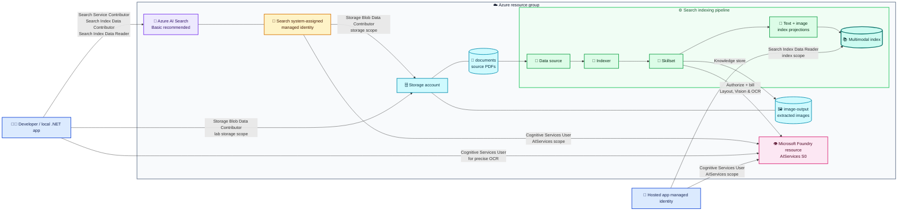

*Verified against Microsoft documentation and a working Azure deployment on 8 August 2026.*

A PDF can contain two different kinds of truth. Some words live in the document's text layer; others are trapped inside screenshots, diagrams, scans, and charts. A conventional text index sees the first kind and silently walks past the second.

In this walkthrough, you will build an Azure AI Search pipeline that extracts PDF text and images, places both in the same vector space with Azure Vision multimodal embeddings, adds OCR so words inside those images become searchable, and finishes with a .NET application that finds and highlights a word or phrase in the original document.

The benefit is bigger than a better search box. The same index can ground RAG applications and agents in evidence that used to be visually present but computationally invisible—while retaining the source document, page, and image location needed to explain *why* a result was returned.

> [!NOTE]
> **Why Azure CLI instead of Terraform?** I would normally provision the resource group, Search service, Storage account, Foundry resource, and RBAC assignments with Terraform. Its declarative state, reviewable plan, repeatability, and drift detection make it the better choice for durable infrastructure. I use Azure CLI (`az`) here to keep the article shorter and focused on the multimodal Search pipeline—not because I recommend replacing infrastructure as code with a shell script.
>
> There is one place where an imperative client really is required: after changing the skillset in Step 5, we must **reset and run the existing indexer**, then inspect its status. Reset, run, and status are Azure AI Search data-plane operations, not persistent infrastructure resources for Terraform to converge. Terraform could wrap the same call in a provisioner, but `az`, an SDK, or REST would still perform the action; Terraform couldn't represent the completed run as desired state and might repeat the side effect when its trigger changes or the wrapper resource is replaced. My usual rule is therefore: **provision with Terraform; operate one-off runtime actions with Azure CLI**. See [Terraform on Azure](https://learn.microsoft.com/azure/developer/terraform/overview) and [run or reset Azure AI Search indexers](https://learn.microsoft.com/azure/search/search-howto-run-reset-indexers).

> [!NOTE]
> The Azure Vision vectorizer and some multimodal capabilities used here are preview features at the time of writing. The final C# sample deliberately uses a preview Search SDK/API. Recheck the [Azure AI Search API version policy](https://learn.microsoft.com/azure/search/search-api-versions) before adopting this design in production.

## What we are building

This article follows the **direct multimodal embedding** route in the portal's **Import data → Multimodal RAG** wizard:

1. Azure AI Search extracts text chunks and inline images from each PDF.
2. Azure Vision embeds text and images into the same 1,024-dimension vector space.
3. An OCR skill reads literal words inside each normalized image.
4. Index projections store text chunks and image records in one index.
5. A query can find a phrase in the PDF text layer, inside an image, or both.
6. The C# application reruns precise OCR on the selected source and draws a tight outline around every occurrence.

This is intentionally different from **image verbalization**, where an LLM first writes a caption for every image and a text embedding model embeds the caption. Verbalization is valuable when a RAG answer needs a ready-made explanation of a complex diagram. Direct Vision embeddings are a simpler fit when text-to-image or image-to-image similarity matters and you want to avoid an LLM call—and its prompt tokens—for every image. The [multimodal search overview](https://learn.microsoft.com/azure/search/multimodal-search-overview) explains both patterns.

> [!TIP]
> OCR and Vision answer different questions. **OCR** asks, “Which characters are visible?” **Vision embeddings** ask, “What image is conceptually similar to this query?” Keeping both lets exact phrase search and semantic image retrieval reinforce one another.

## The map before the journey

### Azure resources

| Resource | Example name | Configuration | Why it exists |
| --- | --- | --- | --- |
| Resource group | `rg-mm-search-demo` | Tutorial lifecycle boundary | Groups the lab resources and provides a convenient cleanup boundary |
| Azure AI Search | `srch-mm-<unique>` | Basic recommended; system-assigned identity; semantic ranker free plan | Hosts the data source, indexer, skillset, vectorizer, semantic configuration, and index |
| Storage account | `stmm<unique>` | Standard GPv2, private containers, TLS 1.2+ | Holds source PDFs and extracted image files |
| Source container | `documents` | Private | Blob indexer data source |
| Image-output container | `image-output` | Private | Knowledge-store destination for extracted images |
| Microsoft Foundry resource | `aif-mm-<unique>` | `AIServices`, S0, custom subdomain | Provides the Vision and Document Intelligence endpoints and bills the built-in enrichment skills |
| Developer or workload identity | Your user for local execution; managed identity when hosted | Search reader plus Cognitive Services User | Runs the final .NET search and precise OCR client |

No Azure OpenAI deployment is required for this direct Azure Vision path. Add Azure OpenAI or a supported Foundry model deployment only if you choose the alternative **image verbalization** route.

> [!NOTE]
> Microsoft documentation and portal blades can use both **Microsoft Foundry resource** and **Azure AI multi-service account** while the naming transition settles. In this article, both refer to the `Microsoft.CognitiveServices/accounts` resource created with `kind=AIServices`.

### Objects created inside Azure AI Search

| Object | Typical generated name | Important configuration |
| --- | --- | --- |
| Data source | `<prefix>-datasource` | Points at the `documents` container; uses the search identity on Basic+ or a connection string on Free |
| Skillset | `<prefix>-skillset` | Wizard-generated extraction, text/image vectorization, Shaper, and index projections; OCR is added in Step 5 |
| Indexer | `<prefix>-indexer` | Drives data source → skillset → index and enables file-data access for enhanced extraction |
| Index | `<prefix>` | Stores separate text and image projection documents |
| Semantic configuration | `<prefix>-semantic-configuration` | Title: `document_title`; content: `content_text` |
| Vectorizer | `<prefix>-aiServicesVision-text-vectorizer` | Azure Vision multimodal model; must match the indexing-time Vectorize skills |
| Vector field | `content_embedding` | `Collection(Edm.Single)`, 1,024 dimensions, HNSW/cosine profile |
| Text discriminator | `text_document_id` | Filterable parent ID for text projections |
| Image discriminator | `image_document_id` | Filterable parent ID for image projections |
| Searchable evidence | `content_text` | PDF text on text records; OCR text on image records after our edit |
| Source metadata | `document_title`, `content_path`, `locationMetadata` | Document name, extracted-image path, page number, and polygons |

> [!IMPORTANT]
> Names and paths in a skillset are case sensitive. The wizard currently generates `locationMetadata`, `pageNumber`, and `boundingPolygons`; the final C# sample expects those exact names.

## Architecture and RBAC



Three useful patterns are visible here:

| Pattern | Where it appears | Benefit |
| --- | --- | --- |
| Enrichment pipeline | Data source → indexer → skillset → index | Repeatable ingestion with clear processing stages |
| Materialized projections | Text chunks and image records share an index but have different parent-ID fields | One query surface without losing modality or parent-document identity |
| Workload identity / least privilege | Search and the calling app have separate principals and roles | No embedded cloud credentials; each runtime receives only the permissions it needs |

## RBAC: who needs what, and where?

Control-plane `Contributor` does not grant Azure AI Search data-plane access. Assign the following explicit roles.

| Principal | Role | Scope | Purpose |
| --- | --- | --- | --- |
| Developer running the wizard | Search Service Contributor | Search service | Create and manage indexes, indexers, data sources, and skillsets |
| Developer running the wizard | Search Index Data Contributor | Search service | Load and update indexed content during setup |
| Developer and local C# app | Search Index Data Reader | Search service for the lab; individual index for production | Query indexed documents |
| Developer | Storage Blob Data Contributor | Storage account for the lab | Create containers and upload PDFs |
| Search service managed identity | Storage Blob Data Contributor | Storage account for the wizard; split to Reader on `documents` and Contributor on `image-output` when hardening | Read source blobs and write extracted images |
| Search service managed identity | Cognitive Services User | Foundry/AIServices resource | Authorize keyless skill billing and Azure Vision embedding calls on Basic+ |
| Developer or hosted app identity | Cognitive Services User | Foundry/AIServices resource | Call Document Intelligence `prebuilt-read` in the final C# workflow |
| Role administrator | Owner, User Access Administrator, or Role Based Access Control Administrator | Only the scope at which assignments are created | Create the preceding role assignments |

> [!TIP]
> The application does **not** inherit the search service's managed identity. The search identity is for outbound calls made by the indexer/vectorizer. Your local user or hosted app identity separately needs `Search Index Data Reader` and `Cognitive Services User`.

## The Free-tier fork: use an API key for Vision

Microsoft Entra ID and Search data-plane RBAC work on every tier, including Free. The important limitation is different: a **Free** search service can't use its own managed identity for outbound indexer, skill, vectorizer, or knowledge-store connections. If you use Free for this lab:

- Choose **API key** when the wizard connects the Azure Vision indexing skill and query vectorizer to **Azure Vision in Foundry Tools**.
- Use a storage connection string for the data source and image-output knowledge store.
- Attach the Foundry resource to the skillset by key so Document Layout and OCR can run beyond their small free enrichment allowance.
- Keep the Search data plane on Microsoft Entra ID/RBAC; the API keys above are for Search's outbound dependencies, not for your application to query Search.
- Keep the key out of source control, screenshots, shell history, and client-side code.

The Free tier has 50 MB of Search storage and is intended for evaluation. The OCR skill currently includes up to 20 documents per indexer per day before a billable resource is required. Image extraction is metered separately: Free includes 20 daily extractions, while billable tiers charge for extraction. Basic is the cleaner tutorial path because it supports the search service's outbound managed identity and removes stored service keys. Although the `AIServicesByKey` billing type itself uses a subdomain endpoint, the Document Layout wizard path and Azure Vision availability still constrain placement; keep all three services in the same supported region for this walkthrough. See [Try Azure AI Search for free](https://learn.microsoft.com/azure/search/search-try-for-free) and [Attach a Foundry resource to a skillset](https://learn.microsoft.com/azure/search/cognitive-search-attach-cognitive-services).

> [!CAUTION]
> An Identity blade or identity property appearing on a Free service is not a reason to depend on that identity for outbound access. The supported boundary is Basic+ for outbound managed identity; use the Azure Vision API key and key-based dependency connections on Free.

## Step 1: provision the Azure resources with Azure CLI

You need Azure CLI, an active subscription, and permission to create role assignments. The commands below use zsh/bash syntax. Replace `replace-me` with a short globally unique suffix containing lowercase letters and digits.

```bash
az login
az account set --subscription "<subscription-name-or-id>"

LOCATION="francecentral"
UNIQUE="replace-me"
RESOURCE_GROUP="rg-mm-search-demo"
SEARCH_NAME="srch-mm-${UNIQUE}"
STORAGE_NAME="stmm${UNIQUE}"
AI_SERVICES_NAME="aif-mm-${UNIQUE}"
SOURCE_CONTAINER="documents"
IMAGE_CONTAINER="image-output"
INDEX_PREFIX="multimodal-rag"

DEVELOPER_OBJECT_ID="$(az ad signed-in-user show --query id --output tsv)"
```

> [!IMPORTANT]
> Choose a region that supports Azure AI Search AI enrichment, Azure Vision multimodal embeddings, and your extraction option. Enhanced extraction also requires Search and the Foundry resource to share a region supported by the Document Layout skill. Start with the [Azure AI Search region table](https://learn.microsoft.com/azure/search/search-region-support) and the [Azure Vision region table](https://learn.microsoft.com/azure/ai-services/computer-vision/overview-image-analysis#feature-availability).

Register the resource providers and create the resource group:

```bash
az provider register --namespace Microsoft.Search --wait
az provider register --namespace Microsoft.Storage --wait
az provider register --namespace Microsoft.CognitiveServices --wait

az group create \
  --name "$RESOURCE_GROUP" \
  --location "$LOCATION"
```

> [!NOTE]
> Provider registration is subscription-scoped and normally happens only once. If your role can't register providers, ask a subscription administrator to register them and then continue with the resource-group-scoped steps.

Create the storage account. Shared-key access remains enabled here only so the same resource can support the Free-tier branch; disable it after moving to the Basic managed-identity path and confirming all connections.

```bash
az storage account create \
  --name "$STORAGE_NAME" \
  --resource-group "$RESOURCE_GROUP" \
  --location "$LOCATION" \
  --kind StorageV2 \
  --sku Standard_LRS \
  --https-only true \
  --min-tls-version TLS1_2 \
  --public-network-access Enabled \
  --allow-blob-public-access false \
  --allow-shared-key-access true
```

Create one Foundry resource with the recommended `AIServices` kind. It supplies the Document Intelligence, Vision embedding, and OCR endpoints used in this article; it does not need a separately deployed model for Azure Vision multimodal embeddings.

```bash
az cognitiveservices account create \
  --name "$AI_SERVICES_NAME" \
  --resource-group "$RESOURCE_GROUP" \
  --location "$LOCATION" \
  --kind AIServices \
  --sku S0 \
  --custom-domain "$AI_SERVICES_NAME" \
  --yes
```

Choose **one** search-tier command.

**Recommended—Basic with managed identity:**

```bash
az search service create \
  --name "$SEARCH_NAME" \
  --resource-group "$RESOURCE_GROUP" \
  --location "$LOCATION" \
  --sku basic \
  --partition-count 1 \
  --replica-count 1 \
  --identity-type SystemAssigned \
  --semantic-search free \
  --disable-local-auth true
```

**Evaluation only—Free with key-based outbound connections:**

```bash
az search service create \
  --name "$SEARCH_NAME" \
  --resource-group "$RESOURCE_GROUP" \
  --location "$LOCATION" \
  --sku free \
  --semantic-search free \
  --disable-local-auth true
```

> [!NOTE]
> An Azure subscription can have only one Free Azure AI Search service. If one already exists, use it or choose Basic.

## Step 2: assign RBAC

Resolve the resource IDs:

```bash
SEARCH_ID="$(az search service show \
  --name "$SEARCH_NAME" \
  --resource-group "$RESOURCE_GROUP" \
  --query id --output tsv)"

STORAGE_ID="$(az storage account show \
  --name "$STORAGE_NAME" \
  --resource-group "$RESOURCE_GROUP" \
  --query id --output tsv)"

AI_SERVICES_ID="$(az cognitiveservices account show \
  --name "$AI_SERVICES_NAME" \
  --resource-group "$RESOURCE_GROUP" \
  --query id --output tsv)"
```

Give the signed-in developer the documented Search wizard roles plus Blob data access:

```bash
az role assignment create \
  --assignee-object-id "$DEVELOPER_OBJECT_ID" \
  --assignee-principal-type User \
  --role "Search Service Contributor" \
  --scope "$SEARCH_ID"

az role assignment create \
  --assignee-object-id "$DEVELOPER_OBJECT_ID" \
  --assignee-principal-type User \
  --role "Search Index Data Contributor" \
  --scope "$SEARCH_ID"

az role assignment create \
  --assignee-object-id "$DEVELOPER_OBJECT_ID" \
  --assignee-principal-type User \
  --role "Search Index Data Reader" \
  --scope "$SEARCH_ID"

az role assignment create \
  --assignee-object-id "$DEVELOPER_OBJECT_ID" \
  --assignee-principal-type User \
  --role "Storage Blob Data Contributor" \
  --scope "$STORAGE_ID"

az role assignment create \
  --assignee-object-id "$DEVELOPER_OBJECT_ID" \
  --assignee-principal-type User \
  --role "Cognitive Services User" \
  --scope "$AI_SERVICES_ID"
```

For the Basic path, give the search service's system-assigned identity access to its dependencies:

```bash
SEARCH_PRINCIPAL_ID="$(az search service show \
  --name "$SEARCH_NAME" \
  --resource-group "$RESOURCE_GROUP" \
  --query identity.principalId --output tsv)"

az role assignment create \
  --assignee-object-id "$SEARCH_PRINCIPAL_ID" \
  --assignee-principal-type ServicePrincipal \
  --role "Storage Blob Data Contributor" \
  --scope "$STORAGE_ID"

az role assignment create \
  --assignee-object-id "$SEARCH_PRINCIPAL_ID" \
  --assignee-principal-type ServicePrincipal \
  --role "Cognitive Services User" \
  --scope "$AI_SERVICES_ID"
```

> [!TIP]
> For a production least-privilege pass, replace storage-account-wide access with `Storage Blob Data Reader` on the source container and `Storage Blob Data Contributor` on the image-output container. The broader account scope above matches Microsoft's wizard quickstart and avoids role-discovery friction during the lab.

Role assignments can take several minutes to propagate. A correctly configured wizard can still return `403` immediately after assignment; wait, refresh the portal, and retry before changing credentials.

## Step 3: create containers and upload the PDF

Use your Microsoft Entra identity rather than a storage key:

```bash
az storage container create \
  --account-name "$STORAGE_NAME" \
  --name "$SOURCE_CONTAINER" \
  --auth-mode login

az storage container create \
  --account-name "$STORAGE_NAME" \
  --name "$IMAGE_CONTAINER" \
  --auth-mode login

az storage blob upload \
  --account-name "$STORAGE_NAME" \
  --container-name "$SOURCE_CONTAINER" \
  --file "/path/to/your-multimodal-document.pdf" \
  --name "your-multimodal-document.pdf" \
  --auth-mode login \
  --overwrite
```

Choose a PDF containing both selectable text and an image with visible words. That gives us a phrase we can prove exists in both modalities later.

## Step 4: import Multimodal RAG in the portal

Open the Azure portal and navigate to your Search service.

> [!IMPORTANT]
> Keep the Search, Storage, and Foundry public endpoints enabled while running the portal wizard; this is a documented wizard requirement. Public blob access remains disabled—the requirement is network reachability, not anonymous container access. Apply firewalls and supported private connectivity after the wizard succeeds, or build the pipeline programmatically from a host inside your virtual network.

> [!TIP]
> On Free, copy a Foundry resource key from **Resource Management → Keys and Endpoint** before starting the wizard. You will use it for Azure Vision on **Content embedding** and again for the skillset billing attachment in Step 5. Treat it as a secret. The storage connection string is likewise a secret and requires permission to list Storage account keys if the portal can't resolve it for you.

1. On **Overview**, select **Import data**.
2. Choose **Azure Blob Storage** as the data source.
3. Select the **Multimodal RAG** scenario.
4. On **Connect to your data**:
   - Select the storage account and `documents` container.
   - On Basic+, select **Authenticate using managed identity → System-assigned**.
   - On Free, use a storage connection string because outbound managed identity isn't supported.
5. On **Content extraction**, select **Azure Document Intelligence in Foundry Tools** for enhanced extraction and location metadata. Select the `AIServices` resource. Use the system-assigned identity on Basic+ or the resource API key on Free.
6. On **Content embedding**:
   - Select **Multimodal Embedding**.
   - Choose **Azure Vision in Foundry Tools**.
   - Select the `AIServices` resource.
   - On Basic+, choose **System assigned identity**.
   - On Free, choose **API key**—this is the important tier-specific exception.
   - Accept the billing acknowledgement.
7. On **Image output**, select the storage account and `image-output` container. Use the system-assigned identity on Basic+ or a storage connection string on Free.
8. On **Advanced settings**:
   - Enable semantic ranking; the free semantic plan is sufficient for tutorial volume.
   - Inspect the generated field list, but keep the default field names shown earlier.
   - Choose **Once** for the first indexing schedule.
9. On **Review and create**, set the object prefix to the value of `INDEX_PREFIX`, review the summary, and select **Create**.

The wizard creates and runs the data source, skillset, index, and indexer. Go to **Search management → Indexers**, open the generated indexer, and confirm its last run succeeded. A successful status can still contain warnings, so read the execution details rather than relying only on the green badge.

> [!NOTE]
> The wizard currently exposes Document Intelligence enhanced extraction, which produces the location metadata expected by the sample. Microsoft now recommends the Content Understanding skill for many net-new programmatic pipelines; Document Layout remains supported for existing wizard-created pipelines. Re-evaluate that extraction choice when moving beyond this walkthrough.

## Step 5: add OCR to the generated skillset

The Vision embedding can retrieve a relevant image without exposing its literal characters as searchable text. We will add an OCR skill and project its `text` output into the existing `content_text` field on image records.

There are two related but distinct connections in this pipeline:

- The generated Azure Vision embedding skills and index vectorizer contain their own provider settings. The wizard configures those with a resource endpoint plus either managed identity or an API key.
- The skillset's root `cognitiveServices` object attaches the Foundry resource for billing built-in skills such as Document Layout and OCR. Updating this object alone does not repair an incorrectly authenticated Vision skill or vectorizer.

### 5.1 Attach the billable AI resource

Go to **Search management → Skillsets**, open `<prefix>-skillset`, and edit its JSON. The wizard might already have created this property for enhanced extraction, so update the existing object rather than adding a duplicate. On Basic+, it should use the search service's system identity:

```json
"cognitiveServices": {
  "@odata.type": "#Microsoft.Azure.Search.AIServicesByIdentity",
  "description": "Bill Document Layout and OCR through the Foundry resource",
  "subdomainUrl": "https://<ai-services-name>.services.ai.azure.com",
  "identity": null
}
```

On Free, use a key connection instead:

```json
"cognitiveServices": {
  "@odata.type": "#Microsoft.Azure.Search.AIServicesByKey",
  "description": "Free-tier billing connection for Document Layout and OCR",
  "subdomainUrl": "https://<ai-services-name>.services.ai.azure.com",
  "key": "<paste-key-in-portal-only>"
}
```

> [!WARNING]
> Search APIs redact stored keys when a resource is read back. Do not GET a key-based skillset and PUT the redacted result over it. Edit in the portal or inject the key securely at deployment time from Key Vault/your CI secret store.

If you must retrieve the key for the portal, use **Keys and Endpoint** on the Foundry resource. The CLI equivalent is below, but it returns a secret—never paste its output into documentation or commit it:

```bash
az cognitiveservices account keys list \
  --name "$AI_SERVICES_NAME" \
  --resource-group "$RESOURCE_GROUP"
```

### 5.2 Append the OCR skill

Add this object to the skillset's `skills` array. Give it a name that does not collide with a wizard-generated skill name.

```json
{
  "@odata.type": "#Microsoft.Skills.Vision.OcrSkill",
  "name": "#ocr-images",
  "description": "Extract literal text from every normalized image",
  "context": "/document/normalized_images/*",
  "defaultLanguageCode": "en",
  "lineEnding": "Space",
  "inputs": [
    {
      "name": "image",
      "source": "/document/normalized_images/*"
    }
  ],
  "outputs": [
    {
      "name": "text",
      "targetName": "ocr_text"
    }
  ]
}
```

Use `"unk"` instead of `"en"` if automatic language detection is more appropriate. Do not add the old `textExtractionAlgorithm` property; it is deprecated because the current Read algorithm handles printed and handwritten text together.

### 5.3 Project OCR into image records

In `indexProjections.selectors`, find the selector whose `parentKeyFieldName` is `image_document_id`. Add this mapping, or replace its existing `content_text` mapping:

```json
{
  "name": "content_text",
  "source": "/document/normalized_images/*/ocr_text"
}
```

Keep the image vector mapping unchanged:

```json
{
  "name": "content_embedding",
  "source": "/document/normalized_images/*/image_vector"
}
```

The image selector should now project, at minimum, `content_text`, `content_embedding`, `content_path`, `document_title`, and `locationMetadata` into the same target index.

> [!IMPORTANT]
> This mapping assumes the direct Vision embedding route used in this article. If you chose image verbalization, `content_text` might already contain the LLM's description. Preserve that field and add a separate searchable `image_ocr_text` field—or merge the caption and OCR—rather than silently replacing useful content.

### 5.4 Confirm normalized images exist

The generated pipeline must populate `/document/normalized_images/*`. Enhanced extraction does this in the skillset. If you use default blob extraction instead, confirm the indexer contains an image action such as:

```json
"parameters": {
  "configuration": {
    "dataToExtract": "contentAndMetadata",
    "parsingMode": "default",
    "imageAction": "generateNormalizedImages",
    "allowSkillsetToReadFileData": true
  }
}
```

Save the skillset. Then reset and run the indexer so existing PDFs receive the new OCR enrichment:

```bash
API_VERSION="2026-04-01"
INDEXER_NAME="${INDEX_PREFIX}-indexer"

az rest \
  --method post \
  --resource https://search.azure.com \
  --uri "https://${SEARCH_NAME}.search.windows.net/indexers/${INDEXER_NAME}/reset?api-version=${API_VERSION}"

az rest \
  --method post \
  --resource https://search.azure.com \
  --uri "https://${SEARCH_NAME}.search.windows.net/indexers/${INDEXER_NAME}/run?api-version=${API_VERSION}"

az rest \
  --method get \
  --resource https://search.azure.com \
  --uri "https://${SEARCH_NAME}.search.windows.net/indexers/${INDEXER_NAME}/status?api-version=${API_VERSION}" \
  --query '{status:status,lastResult:lastResult}'
```

`2026-04-01` is the latest stable Search data-plane API at the publication date and is sufficient for reset, run, and status operations. The wizard-generated index still uses preview features, so use the wizard's preview API version when editing the index definition itself.

The wizard can add a numeric suffix to generated names. Copy the actual indexer name from **Search management → Indexers** if it differs from `${INDEX_PREFIX}-indexer`.

## Step 6: prove that the phrase exists in both modalities

In **Search management → Indexes**, open the generated index and select **Search explorer → JSON view**. First isolate image OCR with an exact phrase query:

```json
{
  "search": "\"Azure AI\"",
  "queryType": "full",
  "searchFields": "content_text",
  "filter": "image_document_id ne null",
  "select": "document_title,content_text,content_path,locationMetadata",
  "count": true,
  "top": 10
}
```

Then change the filter to prove the phrase also appears in a PDF text projection:

```text
text_document_id ne null
```

For a hybrid text-to-image query, use the index's configured Vision vectorizer:

```json
{
  "search": "Azure AI",
  "vectorQueries": [
    {
      "kind": "text",
      "text": "Azure AI",
      "fields": "content_embedding",
      "k": 50
    }
  ],
  "filter": "image_document_id ne null",
  "select": "document_title,content_text,content_path,locationMetadata",
  "count": true,
  "top": 5
}
```

In the deployment used to validate this article, the phrase **“Azure AI”** returned 11 text projections across the corpus and one OCR-backed image projection on page 7. That image's source PDF also appeared among the text matches.

> [!INFO]
>
> 
>
> *The red outlines highlight “foundry” in the PDF text layer near the top and inside the embedded diagram near the bottom—both retrieval paths brought together in the final annotated document.*

## Step 7: run the final C# search-and-highlight application

The [multimodal search-and-highlight gist](https://gist.github.com/garrardkitchen/9d261c076afcd3b921739ab7dad90ceb) is the final piece. It is a .NET 10 file-based application, so its `#:package` directives restore the required NuGet packages without a project file.

### A succinct description of the gist

The gist authenticates with `DefaultAzureCredential`, runs separate hybrid searches over the index's text and image projections, and groups both kinds of evidence back to their source PDF. It retains only documents whose projected `content_text` contains a highlightable match, using a deliberately narrow tolerance for common OCR errors. After the user selects a source, it calls Document Intelligence `prebuilt-read` for word-level polygons and writes a highlighted PDF or image containing tight outlines around every match. It also includes guarded HTTPS downloading, PDF/image coordinate conversion, and a guided Spectre.Console interface.

That final OCR call is deliberate. The search index is optimized for retrieval; Document Intelligence is used only after selection to recover precise word geometry for highlighting. It is a separate, billable analysis of the selected source, so its latency and cost scale with the number of pages sent to `prebuilt-read`.

### Configure and authenticate

Install the .NET 10 SDK and Azure CLI, then sign in:

```bash
az login

export AZURE_SEARCH_INDEX_NAME="multimodal-rag"
export AZURE_DOCUMENT_INTELLIGENCE_ENDPOINT="$(az cognitiveservices account show \
  --name "$AI_SERVICES_NAME" \
  --resource-group "$RESOURCE_GROUP" \
  --query properties.endpoint --output tsv)"
```

Set `AZURE_SEARCH_INDEX_NAME` to the exact generated index name shown under **Search management → Indexes**; the wizard can add a suffix if the requested name already exists.

Update both the Search endpoint and semantic configuration constants near the top of the gist. Copy the semantic configuration name from the generated index JSON instead of assuming its suffix:

```csharp
private const string SearchEndpoint = "https://<search-name>.search.windows.net";
private const string SemanticConfigurationName =
    "<exact-generated-semantic-configuration-name>";
```

These environment variables override the default index name and Document Intelligence endpoint. The developer RBAC assignments from Step 2 satisfy `DefaultAzureCredential` for local execution.

Save the raw gist locally as `multimodal-search.cs`, then search:

```bash
dotnet run --file ./multimodal-search.cs -- "Azure AI"
```

Using `--file` is explicit and avoids a .NET CLI ambiguity if you save the gist inside a directory that also contains a project file.

The application will:

1. Search text and image projections.
2. Show which source documents contain exact text, exact image OCR, or both.
3. Ask you to select a document.
4. Resolve a local PDF/image or a public HTTPS source.
5. Locate every precise occurrence with Document Intelligence.
6. Create a timestamped `.highlighted-*.pdf` or `.png` copy and optionally open it.

> [!TIP]
> Endpoints are identifiers rather than secrets, but configuration still belongs outside code for a reusable sample. A production revision should read the Search endpoint from `AZURE_SEARCH_ENDPOINT` and fail fast when it is absent, just as the file already supports environment overrides for the index and Document Intelligence endpoint.

### Package and preview note

The package versions in the gist were current on 8 August 2026. `Azure.Search.Documents` `12.1.0-beta.1` is intentionally prerelease because the sample uses the `2026-05-01-preview` Search API. The explicit versions make the single-file application reproducible; recheck them together before changing the Search preview API or SDK.

## Troubleshooting the joins between services

| Symptom | Likely cause | Check |
| --- | --- | --- |
| Wizard returns `403` for Storage | Search identity lacks blob data access or RBAC has not propagated | `Storage Blob Data Contributor` scope and role assignment age |
| Vision authentication fails on Free | Managed identity was selected for an outbound connection on an unsupported tier | Check the API key in both the generated Vision embedding skill and the index vectorizer |
| OCR stops after a small batch | No billable Foundry resource is attached | Root `cognitiveServices` billing property; free enrichment limit |
| OCR output is empty | No normalized images reached the skill | Skill context, extraction output, and indexer `imageAction` where applicable |
| Image vectorization fails schema validation | Vector dimensions or model pair do not match | Azure Vision field is 1,024 dimensions; indexing skill and query vectorizer must use the same model version |
| Image results have no literal phrase | OCR output was not projected | Image selector maps `/document/normalized_images/*/ocr_text` to `content_text` |
| C# search gets `403` | The caller has a management role but not a Search data role | Assign `Search Index Data Reader` to the actual user/workload principal |
| Precise highlighting gets `403` | The C# caller, not Search, lacks AI-service access | Assign `Cognitive Services User` to the caller at the AIServices resource |
| Portal wizard cannot reach private endpoints | The wizard requires public access during creation | Run it before lockdown, or use a scripted pipeline from a VNet-connected host |

## Production hardening and cost control

Before treating the lab as a production design:

- Use Basic or higher and managed identities; remove stored data-source, storage, Vision, and OCR keys.
- Keep Search local authentication disabled. For an existing service, confirm Microsoft Entra data-plane access before switching off keys.
- Disable Storage shared-key access once all Storage connections use identity.
- Replace account-wide Blob access with source-container Reader and output-container Contributor roles.
- Use firewalls and supported private endpoints/shared private links after the portal wizard has completed. Check tier support first: several outbound private-link scenarios for skillsets require a higher tier than Basic.
- Put a hosted application's identity on `Search Index Data Reader` at the individual index scope where possible.
- Add document-level authorization filters if different users are allowed to see different source PDFs.
- Enable diagnostic settings for Search and monitor indexer execution history, throttling, and enrichment failures.
- Consider the preview incremental-enrichment cache so unchanged OCR and embeddings can be reused instead of billed again.
- Treat extracted images and OCR text as copies of source data in retention, residency, and sensitivity policies.

> [!WARNING]
> OCR can reproduce sensitive text that was visually embedded to avoid casual discovery. Once indexed, that content is searchable data. Apply the same classification, access control, retention, and deletion rules to the index and image-output container as to the original PDF.

### Prompt and token economy

This direct Vision design does not spend LLM prompt tokens during ingestion. If you switch to image verbalization:

- Exclude logos, separators, and decorative images before calling the LLM.
- Ask for a short factual description with a bounded output rather than a conversational answer.
- Preserve OCR separately; do not ask a vision LLM to reproduce text that OCR can extract more cheaply and deterministically.
- Cache enrichments and reprocess only changed documents.

The demonstration app asks the Search vectorizer to encode the same phrase twice because it issues separate text- and image-filtered searches. If query volume makes that material, call the Vision embedding endpoint once and reuse the raw vector across both requests, or issue one combined retrieval and partition the returned projections. Keep the two-query design when its text-only semantic reranking produces meaningfully better relevance.

## Clean up

This deletes every resource created in the lab and is not recoverable:

```bash
az group delete \
  --name "$RESOURCE_GROUP" \
  --yes \
  --no-wait
```

> [!CAUTION]
> Verify `RESOURCE_GROUP` points only to this lab before running the delete command.

## Closing thought

Search quality is often framed as a ranking problem, but first it is a *visibility* problem. A perfect ranker cannot retrieve evidence that ingestion never made legible. Once our systems can read both the paragraph and the diagram—and show us exactly where each answer came from—the more interesting question is no longer, “Can the AI find it?” It is, “What evidence have we still chosen not to let it see?”

## Sources

- [Multimodal search in Azure AI Search](https://learn.microsoft.com/azure/search/multimodal-search-overview)
- [Quickstart: Multimodal search in the Azure portal](https://learn.microsoft.com/azure/search/search-get-started-portal-image-search)
- [Azure Vision vectorizer](https://learn.microsoft.com/azure/search/vector-search-vectorizer-ai-services-vision)
- [Azure Vision multimodal embeddings skill](https://learn.microsoft.com/azure/search/cognitive-search-skill-vision-vectorize)
- [OCR skill](https://learn.microsoft.com/azure/search/cognitive-search-skill-ocr)
- [Configure a search service managed identity](https://learn.microsoft.com/azure/search/search-how-to-managed-identities)
- [Enable role-based access for Search data-plane operations](https://learn.microsoft.com/azure/search/search-security-enable-roles)
- [Azure AI Search role-based access control](https://learn.microsoft.com/azure/search/search-security-rbac)
- [Attach a Foundry resource to a skillset](https://learn.microsoft.com/azure/search/cognitive-search-attach-cognitive-services)
- [Azure AI Search data-plane API versions](https://learn.microsoft.com/rest/api/searchservice/search-service-api-versions)
- [Create a Foundry resource with Azure CLI](https://learn.microsoft.com/azure/ai-services/multi-service-resource)
- [Manage Azure AI Search with Azure CLI](https://learn.microsoft.com/azure/search/search-manage-azure-cli)
- [Terraform on Azure overview](https://learn.microsoft.com/azure/developer/terraform/overview)
- [Run or reset Azure AI Search indexers](https://learn.microsoft.com/azure/search/search-howto-run-reset-indexers)
- [.NET file-based apps](https://learn.microsoft.com/dotnet/core/sdk/file-based-apps)
- [Multimodal search-and-highlight C# gist](https://gist.github.com/garrardkitchen/9d261c076afcd3b921739ab7dad90ceb)
