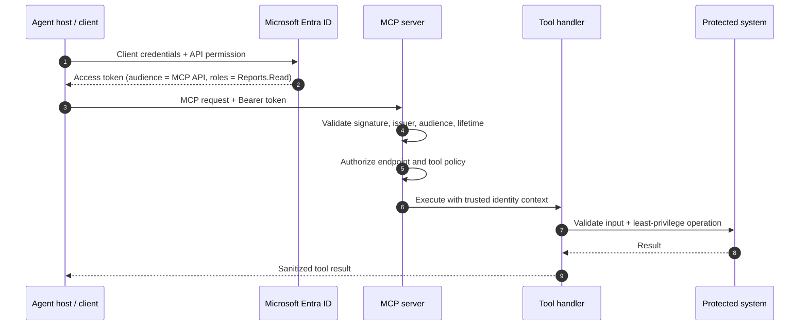
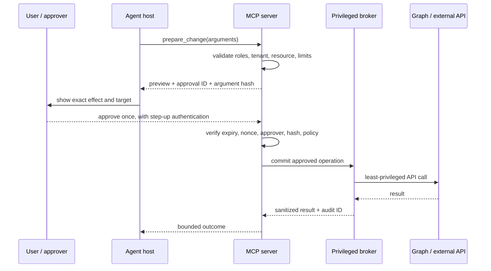

An MCP server can turn a natural-language request into a database query, a file write, a cloud deployment, or a customer-impacting transaction. That is the promise—and the security boundary.

In this guide you will learn how to protect an ASP.NET Core MCP server with Microsoft Entra ID (Microsoft Identity Platform), application roles in app registrations, least-privilege tool authorization, privacy-aware logging, OWASP-aligned defenses, .NET Aspire observability, and unit tests that prove unauthorized tool calls stay unauthorized.

Why does this matter? Imagine the same assistant:

- **Healthcare:** finds a patient’s appointment slot, but must never export an entire patient record because a prompt happened to ask for it.
- **Finance:** prepares a payment, but only a separately assigned `Payments.Approve` role can authorize the final transfer.
- **Cloud operations:** diagnoses a production incident, but a read-only role cannot invoke `Infrastructure.Delete`.
- **Customer support:** summarizes a complaint without leaking a customer’s email address, phone number, or access token into traces or model prompts.

The visual difference between a useful assistant and a dangerous one is often a single missing authorization check. The goal here is to make that check explicit, testable, observable, and boring.

> [!Tip]
> Treat every MCP tool as an API operation with a distinct threat model. “The model chose the tool” is not authorization.

## The security model

Use two app registrations:

1. **MCP API registration** — exposes app roles such as `Reports.Read` and `Payments.Approve`.
2. **Calling client registration** — receives delegated permissions or application permissions to call the MCP API.

For service-to-service calls, the client uses the client-credentials flow. Microsoft Entra ID places the assigned application permissions in the access token’s `roles` claim. The MCP server validates the token, then ASP.NET Core authorization evaluates the role.



For a larger deployment, keep the model provider, MCP boundary, policy engine, telemetry pipeline, and data systems visibly separate:


## 1. Configure app registrations and app roles

In the **MCP API** app registration:

1. Open **Expose an API** and record the Application ID URI.
2. Add app roles under **App roles**.
3. Use stable, code-friendly values without spaces:
   - `Reports.Read` — allowed member type: Applications.
   - `Payments.Read` — allowed member type: Applications.
   - `Payments.Approve` — allowed member type: Applications.
   - `Infrastructure.Read` — allowed member type: Applications.
4. In the caller’s app registration, add **API permissions → My APIs → MCP API → Application permissions**.
5. Grant admin consent.

The role value is part of your authorization contract. Renaming it is a security-sensitive change: update app registration assignments, code, tests, and deployment documentation together.

> [!Warning]
> Do not authorize from `name`, `preferred_username`, group display names, or model-supplied text. Use validated token claims and stable role values. Microsoft documents that app roles appear in the token’s `roles` claim and that APIs still need to verify the expected claim.

## 2. Authenticate and authorize the ASP.NET Core server

The following sample uses `Microsoft.Identity.Web` to configure JWT bearer validation. The `audience` must be the MCP API’s Application ID URI, not the client application’s ID.

At the time of writing, the official Anthropic package is published as `12.35.1` and the official MCP C# SDK is published as `1.3.0`. Pin versions in a central package file, then let your dependency-update process verify newer releases rather than copying these numbers indefinitely:

```xml
<PackageVersion Include="Anthropic" Version="12.35.1" />
<PackageVersion Include="ModelContextProtocol.AspNetCore" Version="1.3.0" />
```

Use the current supported `Microsoft.Identity.Web` version for your target .NET release. The security invariant is more important than a copied number: do not accept a package upgrade that changes token validation or authorization behavior without rerunning the security test suite.

```csharp
using Microsoft.AspNetCore.Authentication.JwtBearer;
using Microsoft.Identity.Web;
using ModelContextProtocol.Server;

WebApplicationBuilder builder = WebApplication.CreateBuilder(args);

builder.Services.AddHttpContextAccessor();

builder.Services
    .AddAuthentication(JwtBearerDefaults.AuthenticationScheme)
    .AddMicrosoftIdentityWebApi(builder.Configuration.GetSection("Entra"));

builder.Services.AddAuthorization(options =>
{
    options.AddPolicy("Mcp.Reports.Read", policy =>
        policy.RequireAuthenticatedUser()
              .RequireClaim("roles", "Reports.Read"));

    options.AddPolicy("Mcp.Payments.Approve", policy =>
        policy.RequireAuthenticatedUser()
              // Both requirements must pass. App roles are not hierarchical.
              .RequireClaim("roles", "Payments.Read")
              .RequireClaim("roles", "Payments.Approve"));
});

builder.Services
    .AddMcpServer()
    .WithHttpTransport()
    // Enables [Authorize], [Authorize(Policy = ...)], and [AllowAnonymous]
    // on MCP tools, prompts, and resources.
    .AddAuthorizationFilters()
    .WithTools<ReportingTools>()
    .WithTools<PaymentTools>();

WebApplication app = builder.Build();

app.UseHttpsRedirection();
app.UseAuthentication();
app.UseAuthorization();

// Require an authenticated caller at the transport boundary.
// Capability-specific roles are enforced by the tool attributes.
app.MapMcp("/mcp")
   .RequireAuthorization();

app.Run();
```

Example configuration:

```json
{
  "Entra": {
    "Instance": "https://login.microsoftonline.com/",
    "TenantId": "00000000-0000-0000-0000-000000000000",
    "ClientId": "00000000-0000-0000-0000-000000000000",
    "Audience": "api://00000000-0000-0000-0000-000000000000"
  }
}
```

In production, keep secrets out of configuration files. Use managed identity, workload identity, or a secret store. For a multi-tenant service, validate the accepted tenant policy explicitly; “valid token” does not mean “valid customer.”

## 3. Authorize at the tool boundary

Transport authorization is a useful coarse gate. It is not enough when a server exposes tools with different impact levels. A read-only MCP endpoint should not make an approval tool reachable merely because both tools share a transport.

The two policies below show why this distinction matters:

- `Mcp.Reports.Read` requires one capability: `Reports.Read`.
- `Mcp.Payments.Approve` requires two independent capabilities: `Payments.Read` **and** `Payments.Approve`.

The first is the right shape for a read-only tool. The second is useful when approval requires both visibility of the payment and explicit approval authority. ASP.NET Core evaluates the policy requirements as an AND; assigning only one of the two app roles is denied.

```csharp
using System.ComponentModel;
using System.Text;
using System.Text.Json;
using Microsoft.AspNetCore.Authorization;
using ModelContextProtocol.Protocol;
using ModelContextProtocol.Server;

[McpServerToolType]
public sealed class ReportingTools
{
    [McpServerTool, Description("Return an aggregate sales report for an approved region.")]
    [Authorize(Policy = "Mcp.Reports.Read")]
    [ToolRateLimit("reports-read")]
    public async Task<CallToolResult> GetSalesReport(
        [Description("An allow-listed region code, such as UK or US.")] string region,
        CancellationToken cancellationToken)
    {
        if (!AllowedRegions.Contains(region, StringComparer.OrdinalIgnoreCase))
        {
            throw new ArgumentException("The region is not supported.", nameof(region));
        }

        // Query only the aggregate needed by the tool. Do not return raw customer records.
        ReportSummary summary = await LoadAggregateAsync(region, cancellationToken);
        string json = JsonSerializer.Serialize(summary);

        if (Encoding.UTF8.GetByteCount(json) > 64 * 1024)
        {
            return new CallToolResult
            {
                IsError = true,
                Content = [new TextContentBlock
                {
                    Text = "The result is too large. Refine the request or use paging."
                }]
            };
        }

        // Keep content for clients that only consume text, and structuredContent
        // for clients that can deserialize the machine-readable result.
        return new CallToolResult
        {
            Content = [new TextContentBlock { Text = json }],
            StructuredContent = JsonSerializer.SerializeToElement(summary)
        };
    }

    private static readonly string[] AllowedRegions = ["UK", "US", "DE"];

    private static Task<ReportSummary> LoadAggregateAsync(
        string region,
        CancellationToken cancellationToken) =>
        Task.FromResult(new ReportSummary(region, 0, 0));
}

public sealed record ReportSummary(string Region, int Orders, decimal Revenue);
```

The approval tool uses the second policy. Its caller must receive both role values in the access token:

```csharp
using System.ComponentModel;
using Microsoft.AspNetCore.Authorization;
using ModelContextProtocol.Server;

[McpServerToolType]
public sealed class PaymentTools
{
    [McpServerTool, Description("Approve an eligible payment after business validation.")]
    [Authorize(Policy = "Mcp.Payments.Approve")]
    [ToolRateLimit("payments-approve")]
    public async Task ApprovePayment(
        [Description("The server-issued payment identifier.")] string paymentId,
        CancellationToken cancellationToken)
    {
        if (!Guid.TryParse(paymentId, out Guid parsedPaymentId))
        {
            throw new ArgumentException("The payment identifier is invalid.", nameof(paymentId));
        }

        // Still apply resource ownership, amount limits, confirmation, idempotency,
        // and audit rules. App roles alone do not authorize a particular payment.
        await ApproveIfEligibleAsync(parsedPaymentId, cancellationToken);
    }

    private static Task ApproveIfEligibleAsync(
        Guid paymentId,
        CancellationToken cancellationToken) => Task.CompletedTask;
}
```

Do not add a second role merely to make a more impressive example. Use multiple requirements when they represent genuinely separate capabilities or a high-impact separation-of-duties control. Otherwise, one narrowly scoped role is easier to administer and less likely to create accidental lockouts.

For an approval or destructive tool, use a separate policy and add business controls: resource ownership, idempotency keys, confirmation, dual control, and an audit record. A role answers **who may attempt this operation**; it does not answer **whether this particular operation is safe**.

## Structured output, payload limits, and guardrails

The original `ReportSummary` return type was strongly typed in C#, but that alone does not guarantee that every MCP client receives an MCP `structuredContent` object. For an output contract that clients must deserialize, return `CallToolResult` with both:

- a bounded machine-readable `StructuredContent` value; and
- a serialized text representation in `Content` for clients that only consume text.

The revised reporting example does this and caps that tool’s serialized result at 64 KiB. Large results should be paged, summarized, or exposed as an access-controlled resource link—not embedded into the model context.

### Payload limits: applying OWASP resource-consumption controls

OWASP API4:2023 requires maximum sizes for incoming parameters and payloads, collection counts, page sizes, operation counts, timeouts, and spending limits. OWASP LLM10:2025 adds input, context-window, per-step, queue, and total-action limits for AI systems. OWASP A10:2025 reinforces quotas, throttling, strict validation, centralized error handling, and fail-closed behavior. None of these mappings mandates a single MCP payload ceiling; they require limits appropriate to the resources and risk of the operation.

Four megabytes is a sensible **absolute transport ceiling** to reduce memory-exhaustion and oversized-request risk, but each tool should have a much smaller budget based on its purpose. Use separate limits for request bodies, individual string fields, array counts, model context, tool output, and downstream responses.

Configure the 4 MB request-body ceiling at Kestrel and at the reverse proxy/API gateway. Rate limiting is different: because every MCP call arrives at the same `/mcp` endpoint, a global ASP.NET endpoint limiter would incorrectly make all tools share one bucket. Apply named limiter policies inside the MCP `CallTool` filter and partition each named policy by tenant and caller.

```csharp
using System.Threading.RateLimiting;
using ModelContextProtocol.Protocol;

const long MaxMcpRequestBytes = 4L * 1024 * 1024;

builder.WebHost.ConfigureKestrel(options =>
{
    options.Limits.MaxRequestBodySize = MaxMcpRequestBytes;
});

builder.Services.AddSingleton<ToolRateLimiter>();

builder.Services
    .AddMcpServer()
    .WithHttpTransport()
    .AddAuthorizationFilters()
    .WithRequestFilters(requestFilters =>
    {
        requestFilters.AddCallToolFilter(next => async (context, cancellationToken) =>
        {
            ToolRateLimiter limiter = context.Services!.GetRequiredService<ToolRateLimiter>();
            ToolRateLimitAttribute? rateLimit = context.MatchedPrimitive?.Metadata
                .OfType<ToolRateLimitAttribute>()
                .FirstOrDefault();

            // Tools without a named policy are not silently assigned a default bucket.
            if (rateLimit is null)
            {
                return await next(context, cancellationToken);
            }

            string tenant = context.User?.FindFirst("tid")?.Value ?? "unknown-tenant";
            string caller = context.User?.FindFirst("oid")?.Value
                ?? context.User?.FindFirst("appid")?.Value
                ?? "anonymous";

            RateLimitLease lease = await limiter.AcquireAsync(
                rateLimit.PolicyName,
                $"{tenant}:{caller}",
                cancellationToken);

            if (!lease.IsAcquired)
            {
                return new CallToolResult
                {
                    IsError = true,
                    Content = [new TextContentBlock
                    {
                        Text = "This tool is temporarily rate-limited. Try again later."
                    }]
                };
            }

            return await next(context, cancellationToken);
        });
    })
    .WithTools<ReportingTools>()
    .WithTools<PaymentTools>();

public sealed class ToolRateLimiter : IDisposable
{
    private readonly IReadOnlyDictionary<string, PartitionedRateLimiter<string>> limiters;

    public ToolRateLimiter()
    {
        limiters = new Dictionary<string, PartitionedRateLimiter<string>>
        {
            ["reports-read"] = CreateLimiter(tokenLimit: 60, tokensPerPeriod: 60),
            ["payments-approve"] = CreateLimiter(tokenLimit: 5, tokensPerPeriod: 5)
        };
    }

    private static PartitionedRateLimiter<string> CreateLimiter(
        int tokenLimit,
        int tokensPerPeriod) =>
        PartitionedRateLimiter.Create<string, string>(partitionKey =>
            RateLimitPartition.GetTokenBucketLimiter(partitionKey, _ =>
                new TokenBucketRateLimiterOptions
                {
                    TokenLimit = tokenLimit,
                    TokensPerPeriod = tokensPerPeriod,
                    ReplenishmentPeriod = TimeSpan.FromMinutes(1),
                    AutoReplenishment = true,
                    QueueLimit = 0
                }));

    public ValueTask<RateLimitLease> AcquireAsync(
        string policyName,
        string partitionKey,
        CancellationToken cancellationToken) =>
        limiters.TryGetValue(policyName, out PartitionedRateLimiter<string>? limiter)
            ? limiter.AcquireAsync(partitionKey, permitCount: 1, cancellationToken)
            : throw new InvalidOperationException(
                $"No rate-limit policy is registered with name '{policyName}'.");

    public void Dispose()
    {
        foreach (PartitionedRateLimiter<string> limiter in limiters.Values)
        {
            limiter.Dispose();
        }
    }
}
```

Apply those named policies declaratively to tools:

```csharp
[McpServerToolType]
public sealed class ReportingTools
{
    [McpServerTool, Description("Return an aggregate sales report.")]
    [Authorize(Policy = "Mcp.Reports.Read")]
    [ToolRateLimit("reports-read")]
    public Task<CallToolResult> GetSalesReport(string region, CancellationToken cancellationToken) =>
        Task.FromResult(new CallToolResult());
}

[McpServerToolType]
public sealed class PaymentTools
{
    [McpServerTool, Description("Approve an eligible payment.")]
    [Authorize(Policy = "Mcp.Payments.Approve")]
    [ToolRateLimit("payments-approve")]
    public Task ApprovePayment(string paymentId, CancellationToken cancellationToken) =>
        Task.CompletedTask;
}

[AttributeUsage(AttributeTargets.Method | AttributeTargets.Class)]
public sealed class ToolRateLimitAttribute(string policyName) : Attribute
{
    public string PolicyName { get; } = policyName;
}
```

This creates independent named buckets such as `reports-read` and `payments-approve`, each partitioned by tenant and caller. A policy name is part of the operational contract: review it like authorization configuration, alert when it is missing, and fail fast rather than silently falling back for unknown names. Give expensive or side-effecting tools stricter limits and concurrency gates than read-only tools. Rate limits are not authorization; also honor downstream `Retry-After` responses and apply timeouts, cancellation, maximum page sizes, maximum batch counts, maximum string lengths, bounded recursion/depth, response truncation, circuit breakers, and an overall cost/time budget per request.

Other guardrails worth making explicit:

- **Outbound HTTP:** allow-list hosts and methods; reject arbitrary URLs, private address ranges, redirects to new hosts, unsafe schemes, and unbounded response bodies to prevent SSRF and data exfiltration.
- **Data access:** use parameterized queries, tenant filters in the data layer, row/column minimization, and output classification. Never let the model choose a database connection, table, or Graph permission.
- **Tool metadata:** mark read-only, destructive, and idempotent behavior accurately. These annotations help clients present safer UX, but they do not replace server-side authorization.
- **Errors:** return bounded, generic errors to the model; keep detailed exception data in protected telemetry. Fail closed when policy, identity, or dependency state is ambiguous.
- **Supply chain:** pin and scan packages, verify tool inventory and ownership, and prevent unapproved “shadow” MCP servers from reaching production data.

## Calling Microsoft Graph or another elevated API

Do not give the general MCP server broad Microsoft Graph application permissions and rely on the model to behave. In app-only mode, an application permission can authorize access across the associated tenant data. Microsoft recommends requesting the least-privileged Graph permission, and Graph application permissions require administrator consent.

Prefer this separation:

1. The MCP server holds only the permissions needed for low-risk read operations.
2. A narrowly scoped broker or worker has the elevated managed identity and Graph permissions.
3. The MCP server calls the broker through a private, authenticated API with its own app role.
4. The broker re-authorizes the specific operation, tenant, resource, and approved arguments before calling Graph.

Where the user’s delegated context is required, prefer delegated access or on-behalf-of flow when the scenario supports it. Do not implement “permission escalation” by acquiring a broader token because a prompt requested it. Application-only permissions cannot be dynamically elevated per model turn; consent and assignment are administrative controls, not runtime approval.

## Approval for high-impact actions

Yes—use an approval process for actions that send mail, change directory objects, alter permissions, spend money, delete data, deploy infrastructure, or call Graph with tenant-wide application permissions. Separate **prepare** from **commit**:



An approval should be short-lived, single-use, bound to the tenant, subject, tool, resource, and canonical argument hash, and recorded in an append-only audit trail. Re-check authorization and resource state at commit time; never trust an approval created before a role revocation or data change. Use idempotency keys, dry-run previews, amount/record-count limits, dual approval for exceptional risk, and a kill switch.

This is separate from Microsoft Entra admin consent. Admin consent grants an application a capability; per-action approval decides whether a particular high-impact operation may happen now. Use both where both risks exist.

### Declarative authorization on MCP tools

With the ASP.NET Core MCP integration, call `AddAuthorizationFilters()` when registering the MCP server. The current SDK then applies standard ASP.NET Core authorization attributes to MCP tools, prompts, and resources. This is the concise, declarative version:

```csharp
[McpServerTool, Description("Approve an eligible payment.")]
[Authorize(Policy = "Mcp.Payments.Approve")]
public Task ApprovePayment(string paymentId, CancellationToken cancellationToken)
    => paymentService.ApproveAsync(paymentId, cancellationToken);
```

`[Authorize("Mcp.Payments.Approve")]` is also a valid shorthand for the named policy. The important part is not the attribute alone; it is the combination of the attribute and `.AddAuthorizationFilters()`. Without that registration, the method metadata is not an enforcement mechanism.

Keep `RequireAuthorization` on the mapped MCP endpoint as a coarse authenticated boundary, and use method-level attributes for capability-specific authorization. The SDK filters unauthorized tools out of capability listings and rejects unauthorized individual tool calls.

## 4. Calling Claude with the official Anthropic C# SDK

The official package is `Anthropic` (10+), maintained in `anthropics/anthropic-sdk-csharp`. The following client is intentionally separated from authorization: the model can suggest a tool call, but the MCP server remains the policy enforcement point.

```csharp
using Anthropic;
using Anthropic.Models.Messages;

public sealed class ClaudePlanner(AnthropicClient client)
{
    public async Task<string> PlanAsync(string sanitizedRequest, CancellationToken cancellationToken)
    {
        ArgumentException.ThrowIfNullOrWhiteSpace(sanitizedRequest);

        MessageCreateParams parameters = new()
        {
            Model = "claude-opus-4-6",
            MaxTokens = 600,
            System = "You may suggest read-only reports. Never claim authorization; the server decides.",
            Messages =
            [
                new()
                {
                    Role = Role.User,
                    Content = sanitizedRequest
                }
            ]
        };

        Message response = await client.Messages.Create(parameters, cancellationToken);
        return response.ToString();
    }
}
```

Pin the package version in `Directory.Packages.props`, review SDK release notes, and inject the client through `IHttpClientFactory` or the SDK’s supported DI setup. Never place an Anthropic API key in a prompt, log entry, app registration, or source file.

## 5. Logging, PII, and observability with Aspire

Security logs should answer: who called, what tool was requested, which policy decided, which resource class was affected, whether it succeeded, and how to correlate the event. They should not answer by dumping the entire prompt, token, tool arguments, database row, or model response.

Use structured logs and a redaction policy:

```csharp
public static partial class SecurityLog
{
    [LoggerMessage(
        EventId = 4101,
        Level = LogLevel.Information,
        Message = "MCP tool completed. Tool={Tool} Decision={Decision} TraceId={TraceId}")]
    public static partial void ToolCompleted(
        this ILogger logger,
        string tool,
        string decision,
        string traceId);
}
```

Log these fields when appropriate:

- stable pseudonymous subject or service-principal ID, not an email address;
- tenant ID, client ID, token issuer, tool name, role/policy decision;
- correlation/trace ID, duration, outcome, and coarse resource classification;
- validation failures and authorization failures, with rate-limited alerts.

Never log bearer tokens, client secrets, API keys, full prompts, raw tool arguments, free-form customer content, health data, payment data, or full model responses. If an argument is needed for forensic value, hash or classify it, and document retention and access controls. Remember that traces, exception telemetry, metrics labels, dead-letter queues, and support dumps are logs too.

> [!Tip]
> Redaction is not a substitute for data minimization. The safest PII is the PII your tool never retrieves, never sends to the model, and never emits to telemetry.

In .NET Aspire, put OpenTelemetry, health checks, service discovery, and resilience in shared service defaults. Export only the fields approved by your data-classification policy. The Aspire dashboard is excellent for local correlation; production telemetry still needs access control, retention, alerting, and tamper resistance.

```csharp
// ServiceDefaults/Extensions.cs - keep security telemetry policy here.
public static IHostApplicationBuilder AddSecureServiceDefaults(
    this IHostApplicationBuilder builder)
{
    builder.AddDefaultHealthChecks();
    builder.AddDefaultOpenTelemetry();

    // Add explicit filters/processors for PII redaction before exporting.
    // Do not export request bodies or Authorization headers.
    return builder;
}
```

## OWASP practices and the attack vectors they address

| Practice | Why it matters | Attack vector addressed |
| --- | --- | --- |
| **A01 Broken Access Control**: verify `roles` and enforce per-tool policies | A valid token only proves identity; it does not grant every capability | Stolen low-privilege token invoking approval, deletion, or another tenant’s data |
| **A02 Security Misconfiguration**: HTTPS, strict CORS/allowed hosts, disabled unused transports, secure headers | Defaults and exposed diagnostics create unintended entry points | Internet scanning, origin abuse, metadata leakage, downgrade and debug exposure |
| **A03 Software Supply Chain Failures**: pin and scan MCP, identity, and Anthropic packages; review tool servers | MCP servers and SDKs execute code with access to your data | Malicious or compromised dependency, typosquatting, poisoned tool package |
| **A04 Cryptographic Failures**: validate JWT signature/issuer/audience/lifetime; use TLS; protect keys | Authentication collapses if token integrity or transport confidentiality fails | Forged token, replay over plaintext, leaked client secret |
| **A05 Injection**: schema validation, parameterized queries, output encoding, prompt/data separation | Tool arguments and retrieved content can contain attacker-controlled text | SQL/command injection, path traversal, indirect prompt injection |
| **A06 Insecure Design**: threat model each tool, require confirmation and idempotency for side effects | Some risks cannot be patched into existence after the fact | Confused deputy, unsafe automation, irreversible actions from ambiguous prompts |
| **A07 Authentication Failures**: use managed identity/client credentials, short-lived tokens, least privilege | Long-lived shared secrets are easy to steal and hard to rotate | Credential theft, token replay, unauthorized service impersonation |
| **A08 Software or Data Integrity Failures**: verify schemas, signed artifacts, and trusted upstream data | Agents can act on tampered tool metadata or data | Tool description poisoning, response tampering, unsafe model decisions |
| **A09 Security Logging & Alerting Failures**: log allow/deny decisions, alert on anomalies, protect logs | An attack that cannot be detected becomes an incident that cannot be contained | Silent role abuse, repeated probing, destructive action without evidence |
| **A10 Mishandling Exceptional Conditions**: fail closed, bounded timeouts, cancellation, safe error messages | Errors often create accidental authorization bypasses | Fail-open policy, leaked stack traces, retry storms, denial of service |

MCP-specific risks reinforce the same controls: tool poisoning and context injection make input validation and trust boundaries essential; excessive agency makes least privilege and confirmation essential; shadow servers make inventory, ownership, and telemetry essential.

### OWASP’s payload and resource-limit requirements

OWASP does not prescribe a single MCP payload size. It does require the underlying controls that make a limit meaningful:

- **OWASP API4:2023 — Unrestricted Resource Consumption:** define and enforce maximum sizes for incoming parameters and payloads, maximum string lengths, array element counts, upload sizes, page sizes, operation counts, timeouts, and spending limits. It also calls for operation-specific rate limiting.
- **OWASP LLM10:2025 — Unbounded Consumption:** enforce reasonable input limits, cap resource use per request or step, limit queued and total actions, apply rate limits, and protect the model context window from oversized or repeated inputs.
- **OWASP Top 10:2025 A10 — Mishandling of Exceptional Conditions:** use rate limits, quotas, throttling, strict validation, centralized error handling, and fail-closed behavior so abnormal input cannot become a denial of service or an exceptional cloud bill.

For this MCP server, the practical control set is therefore: a transport ceiling, smaller named per-tool budgets, bounded fields and collections, bounded outputs, pagination, action/concurrency limits, downstream spending limits, timeouts, and monitoring. Choose the byte values from measured worst-case memory, CPU, model-token, downstream API, and cost budgets; document them as security requirements and test them at the boundary.

## Unit test the tooling, not just the token middleware

The highest-value tests assert that each tool’s authorization decision is independent of the model and cannot be bypassed with a crafted argument. With `AddAuthorizationFilters()`, the role decision is made by the MCP SDK filter before the method body runs, so unit-test the tool’s business validation separately and integration-test the authorization filter through the hosted MCP endpoint.

```csharp
using Xunit;

public sealed class ReportingToolsTests
{
    [Fact]
    public async Task Report_rejects_an_unallowlisted_region()
    {
        ReportingTools tools = new();

        await Assert.ThrowsAsync<ArgumentException>(() =>
            tools.GetSalesReport("FR", CancellationToken.None));
    }
}
```

Add tests for:

- missing, wrong, expired, wrong-audience, and wrong-tenant tokens;
- a hosted MCP call with only `Reports.Read` cannot invoke the payment tool;
- `Payments.Read` without `Payments.Approve` is denied, and `Payments.Approve` without `Payments.Read` is also denied;
- invalid region, tenant, resource ID, path, URL, and query arguments;
- prompt injection text is treated as data, not instructions;
- approval tools require confirmation, idempotency, and an audit event;
- logs contain correlation metadata but no token, prompt, PII, or secret;
- timeouts and dependency failures return safe errors and do not authorize;
- rate limits and alert thresholds trigger under repeated denied calls.

Use integration tests with a test identity provider or signed test tokens to verify the complete middleware and MCP authorization-filter path. Assert that the payment tool returns an authorization error when either role is absent, and succeeds only when both roles are present. Then run dynamic tests against the hosted MCP endpoint with the MCP Inspector or an equivalent test client. A unit test that calls a tool class directly is valuable; it does not prove the deployed route or SDK authorization filter is protected.

## A practical production checklist

- Inventory every server, tool, data source, side effect, owner, and tenant boundary.
- Define one app role per meaningful capability; separate human and application roles where their semantics differ.
- Validate issuer, audience, signature, lifetime, tenant, and `roles` claim.
- Enforce authorization at transport, tool, resource, and business-operation boundaries.
- Set a transport ceiling, smaller per-tool payload budgets, page large results, and reject oversized requests before parsing them.
- Rate-limit by tenant and subject/client, and add stricter quotas and concurrency limits to expensive or side-effecting tools.
- Separate prepare/preview from commit for high-impact actions and require short-lived, auditable approval.
- Isolate elevated Graph permissions behind a narrowly scoped broker or worker with its own managed identity.
- Use managed identity or a secret manager for outbound credentials.
- Validate and bound all tool inputs; use allow-lists and parameterized data access.
- Minimize model context and redact telemetry by default.
- Add structured security logs, protected retention, dashboards, alerts, and incident playbooks.
- Pin dependencies and scan the complete supply chain.
- Test denial paths, side effects, PII handling, and failure modes continuously.

## Closing thought

An MCP server does not become trustworthy because a model is helpful. It becomes trustworthy when the most persuasive prompt, the most privileged token, and the most surprising failure still meet a boundary that refuses to guess.

## References

- [Microsoft Entra app roles and role claims](https://learn.microsoft.com/en-us/entra/identity-platform/howto-add-app-roles-in-apps)
- [Microsoft guidance for verifying scopes and app roles](https://learn.microsoft.com/en-us/entra/identity-platform/scenario-protected-web-api-verification-scope-app-roles)
- [Official MCP C# SDK](https://github.com/modelcontextprotocol/csharp-sdk)
- [MCP tool output schema and structured content](https://github.com/modelcontextprotocol/modelcontextprotocol/blob/main/schema/2025-06-18/schema.ts)
- [MCP C# SDK authorization filters and attributes](https://github.com/modelcontextprotocol/csharp-sdk/blob/main/docs/concepts/filters.md)
- [MCP C# SDK identity and role propagation](https://github.com/modelcontextprotocol/csharp-sdk/blob/main/docs/concepts/identity/identity.md)
- [Official Anthropic C# SDK](https://github.com/anthropics/anthropic-sdk-csharp)
- [Microsoft Graph permissions overview](https://learn.microsoft.com/en-us/graph/permissions-overview)
- [OWASP gRPC security guidance on message-size limits](https://cheatsheetseries.owasp.org/cheatsheets/gRPC_Security_Cheat_Sheet.html)
- [Microsoft .NET Aspire service defaults](https://aspire.dev/fundamentals/service-defaults/)
- [OWASP Top 10:2025](https://owasp.org/Top10/2025/)
- [OWASP MCP Top 10](https://owasp.org/www-project-mcp-top-10/)
- [OWASP API4:2023 — Unrestricted Resource Consumption](https://owasp.org/API-Security/editions/2023/en/0xa4-unrestricted-resource-consumption/)
- [OWASP LLM10:2025 — Unbounded Consumption](https://genai.owasp.org/llmrisk/llm102025-unbounded-consumption/)
- [OWASP A10:2025 — Mishandling of Exceptional Conditions](https://owasp.org/Top10/2025/A10_2025-Mishandling_of_Exceptional_Conditions/)
