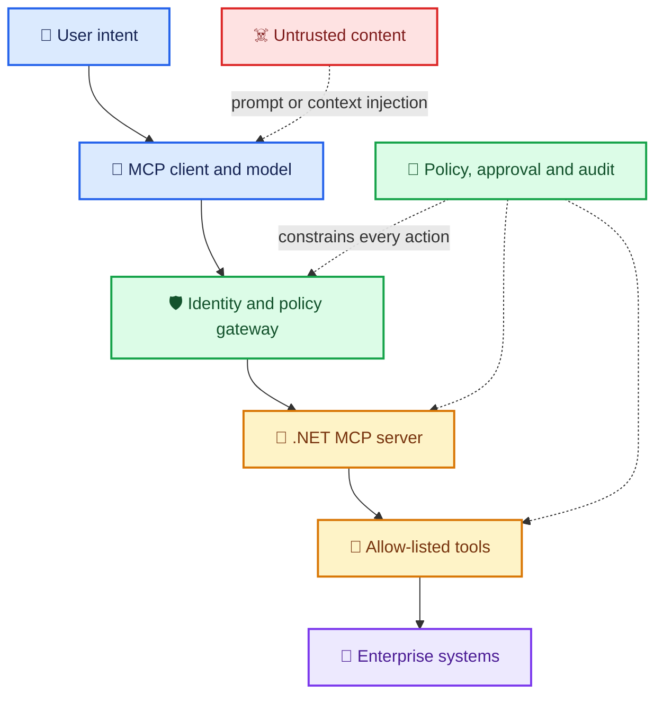
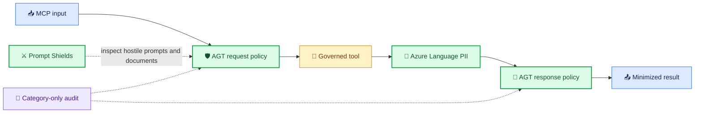
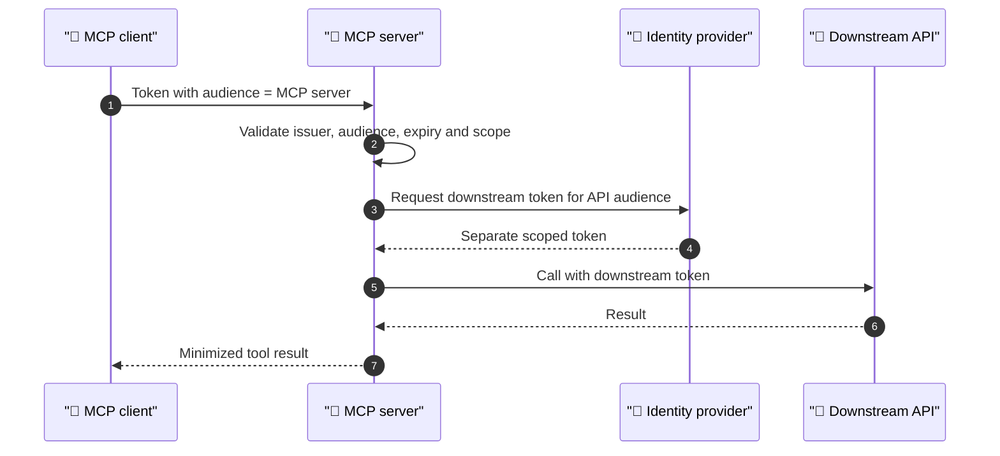

## The minimum security controls for a production-grade Model Context Protocol server

> **A practical security baseline for C#, ASP.NET Core, Streamable HTTP and Azure**

Every important technology begins with a period of optimism.

We focus on what it enables. We celebrate how quickly it connects systems that previously required bespoke integration. We build demonstrations, prove the value and then—usually after the first uncomfortable incident—ask the question we should have asked at the beginning:

**What new authority did we just create?**

That question matters enormously for the Model Context Protocol (MCP).

An ordinary API waits for a caller to select an operation. An MCP server publishes tools, resources and prompts to a model-driven client that may select and combine them dynamically. The server can become the bridge between probabilistic reasoning and deterministic enterprise systems: source control, databases, ticketing platforms, cloud control planes, customer records and internal knowledge.

That makes MCP useful. It also makes an insecure MCP server a particularly efficient confused deputy.

The security goal is not to make the model “trustworthy”. A model can be manipulated by hostile instructions embedded in a user prompt, document, tool description or tool result. The goal is to ensure that even when the reasoning layer is wrong, manipulated or simply overconfident, the deterministic system around it constrains the damage.

This article defines the **minimum set of security controls that a remote MCP server written in C# on ASP.NET Core should implement before it handles production data or invokes production actions**. It draws from:

- the stable [MCP specification dated 25 November 2025](https://modelcontextprotocol.io/specification/2025-11-25);
- the MCP project’s [Security Best Practices](https://modelcontextprotocol.io/docs/tutorials/security/security_best_practices);
- the [OWASP MCP Top 10 v0.1 beta](https://owasp.org/www-project-mcp-top-10/);
- the [OWASP API Security Top 10:2023](https://owasp.org/API-Security/editions/2023/en/0x11-t10/);
- the [OWASP Top 10:2025](https://owasp.org/Top10/2025/);
- the [OWASP Practical Guide for Secure MCP Server Development](https://genai.owasp.org/resource/a-practical-guide-for-secure-mcp-server-development/); and
- current ASP.NET Core and .NET security capabilities.

> [!IMPORTANT]
> This is a minimum viable **security baseline**, not a compliance certificate. A server that can modify infrastructure, transfer money, administer identities or access regulated data needs additional controls based on its threat model and business impact.

---

## MCP changes the shape of the API threat model

An MCP server is still software. It can still suffer from broken access control, injection, security misconfiguration, vulnerable dependencies, SSRF and missing audit evidence. The traditional application and API risks do not disappear.

MCP adds another layer:

- **Tools are discovered dynamically.** Their names, descriptions and schemas influence model behaviour.
- **Natural language can become control flow.** Untrusted content may be interpreted as an instruction rather than inert data.
- **A client may chain several operations.** Individually permitted actions can create an unsafe combined outcome.
- **Authority is often delegated.** The server may act for a user, a workload or both.
- **Context crosses trust boundaries.** Prompts, documents, model output, tool metadata and downstream responses can all affect a decision.
- **The caller is not necessarily the decision-maker.** A human may initiate the task, but a model chooses the tool and constructs its arguments.

This means an MCP security design must protect three things simultaneously:

1. the **protocol surface**;
2. the **tool implementation**; and
3. the **enterprise capability behind the tool**.

Securing only the HTTP endpoint is not enough. A perfectly authenticated request can still invoke the wrong tool, against the wrong resource, with excessive authority, using arguments influenced by hostile context.



The diagram makes the governing principle visible:

> [!TIP]
> **Treat model intent as untrusted input. Authentication proves who initiated a request; it does not prove that the requested action is safe, intended or correctly reasoned.**

---

## Which OWASP lists apply?

Several OWASP lists overlap here, but they answer different questions.

| Source | What it contributes to an MCP threat model |
| --- | --- |
| [OWASP Top 10:2025](https://owasp.org/Top10/2025/) | General application risks such as broken access control, security misconfiguration, supply-chain failure, cryptographic failure, injection, insecure design and logging failure. |
| [OWASP API Security Top 10:2023](https://owasp.org/API-Security/editions/2023/en/0x11-t10/) | API-specific risks including object- and function-level authorization, unrestricted resource consumption, SSRF, unsafe downstream API consumption and inventory failure. |
| [OWASP MCP Top 10 v0.1](https://owasp.org/www-project-mcp-top-10/) | MCP-specific concerns: tool poisoning, scope creep, intent-flow subversion, context over-sharing, shadow MCP deployments and token handling. |
| [OWASP Top 10 for Agentic Applications 2026](https://genai.owasp.org/initiatives/agentic-security-initiative/) | Broader agentic-system risks where multiple agents, memory, planning and autonomous action extend beyond one MCP server. |

The MCP list is valuable, but its status matters. As of July 2026, OWASP labels it **v0.1, Phase 3 beta and pilot testing**. It should inform the threat model, not be presented as a final compliance standard.

Its current ten risks are:

| ID | Risk | Minimum server response |
| --- | --- | --- |
| MCP01 | Token mismanagement and secret exposure | Short-lived audience-bound tokens, secure secret storage, redaction and no token logging. |
| MCP02 | Privilege escalation via scope creep | Narrow scopes, tool-level policy, least-privilege downstream identities and periodic access review. |
| MCP03 | Tool poisoning | Controlled tool registration, immutable reviewed metadata, provenance and change detection. |
| MCP04 | Software supply-chain attacks | Locked dependencies, vulnerability audit, trusted feeds, signed build provenance and image scanning. |
| MCP05 | Command injection and execution | No shell construction from tool input; strict schemas, allow-lists and sandboxed execution where unavoidable. |
| MCP06 | Intent-flow subversion | Treat retrieved content and tool output as data; enforce policy outside the model. |
| MCP07 | Insufficient authentication and authorization | Deny-by-default authentication, per-tool and per-resource authorization, audience and issuer validation. |
| MCP08 | Lack of audit and telemetry | Structured, correlated, tamper-resistant action audit without secrets or unnecessary sensitive content. |
| MCP09 | Shadow MCP servers | Approved registry, ownership, inventory, discovery controls and deployment policy. |
| MCP10 | Context injection and over-sharing | Tenant and session isolation, output minimisation, classification and explicit context boundaries. |

The most important conclusion is that no single OWASP list is sufficient. An MCP server is simultaneously a web application, an API, an OAuth resource server, a tool catalogue and part of an AI control loop.

---

## Microsoft’s new MCP guardrail layer

Microsoft has now released the open-source **Agent Governance Toolkit (AGT)** and a dedicated extension for servers built with the official MCP C# SDK:

- [`Microsoft.AgentGovernance`](https://microsoft.github.io/agent-governance-toolkit/tutorials/19-dotnet-sdk/); and
- [`Microsoft.AgentGovernance.Extensions.ModelContextProtocol`](https://microsoft.github.io/agent-governance-toolkit/tutorials/42-csharp-mcp-extension/).

Microsoft’s [.NET guidance published on 29 April 2026](https://devblogs.microsoft.com/dotnet/governing-mcp-tool-calls-in-dotnet-with-the-agent-governance-toolkit/) positions AGT as a deterministic governance layer around MCP tool execution. It introduces four particularly relevant components:

| Component | Security purpose |
| --- | --- |
| `McpGateway` | Evaluates tool calls against centralized policy before execution. |
| `McpSecurityScanner` | Scans tool names, descriptions and schemas for poisoning, suspicious instructions and typosquatting indicators. |
| `McpResponseSanitizer` | Inspects tool results before they are returned to the client or reintroduced into model context. |
| `GovernanceKernel` | Coordinates policy, audit events, rate limits, circuit breaking and OpenTelemetry signals. |

For a C# MCP server, the extension can wrap the official SDK’s tool collection so that:

- every `tools/call` request is evaluated before the tool executes;
- policy can distinguish authenticated callers using `agent_id`, name-identifier or name claims;
- a deny-by-default policy can expose an explicit allow-list of tools to each caller;
- denied calls fail closed;
- unsafe tool definitions can stop server initialization;
- fallback tool handlers are governed; and
- text results are sanitized before they leave the server.

```csharp
using AgentGovernance.Extensions.ModelContextProtocol;

var builder = WebApplication.CreateBuilder(args);

builder.Services
    .AddMcpServer()
    .WithGovernance(options =>
    {
        options.PolicyPaths.Add("policies/mcp.yaml");
        options.DefaultAgentId = "did:mcp:anonymous";
        options.ServerName = "enterprise-mcp";

        options.ScanToolsOnStartup = true;
        options.FailOnUnsafeTools = true;
        options.SanitizeResponses = true;
        options.GovernFallbackHandlers = true;
    });
```

`DefaultAgentId` is a fallback policy identity, not authentication. A production server must populate the request principal from a validated access token and should normally deny the anonymous fallback. The extension resolves an agent identity from the `agent_id` claim, `ClaimTypes.NameIdentifier`, `User.Identity.Name`, a request item, and finally `DefaultAgentId`. This enables different tool policies for different callers, but it does not prove that the identity is genuine; ASP.NET Core authentication must do that first.

The minimum useful policy is **deny by default, then explicitly allow a named tool for a named class of caller**. Treat tool discovery and tool execution as separate decisions: a caller should not be shown a high-risk tool merely because a later policy would block its invocation. Where the current SDK or extension cannot filter `tools/list` per caller, split tool catalogues across separately authorized MCP servers or add a governed discovery layer.

### What the extension enforces—and what still needs wiring

The Agent Governance Toolkit is a wider ecosystem than the C# MCP extension. That distinction matters when assessing a control:

| Capability | C# MCP extension behaviour | Production responsibility |
| --- | --- | --- |
| Pre-execution policy | Wraps registered tools and evaluates every `tools/call`. | Author restrictive policies, test deny paths and bind decisions to authenticated identities. |
| Tool-definition scanning | Scans tool names, descriptions and schemas during startup; unsafe definitions can fail initialization. | Scan again in CI/CD and govern tool or package changes through review. |
| Response sanitization | Rewrites supported unsafe text blocks before returning them. | Test non-text content, structured payloads, resources, prompts and streaming paths separately. |
| Fallback handlers | Can govern fallback `tools/call` handlers. | Keep `GovernFallbackHandlers` enabled and test custom routing paths. |
| Audit and telemetry | `GovernanceKernel` emits audit events and OpenTelemetry signals. | Export them to a protected sink, alert on denials and never attach raw sensitive content. |
| Rate limits and circuit breakers | Available through the wider governance and reliability capabilities; they are not established merely by calling `WithGovernance`. | Configure and verify limits at the gateway, server and downstream dependency layers. |
| PII and secret protection | Provides fast pattern-based scanning and sanitization concepts at the MCP boundary. | Add comprehensive classification, redaction, minimization and data-loss controls. |

> [!WARNING]
> Installing a governance package is not evidence that governance is active. Prove each control with a negative test: an unauthorized identity, an unlisted tool, a poisoned description, a credential-bearing response, a PII-bearing response, a fallback handler and a failed guardrail dependency. A guardrail that has never blocked anything in a test is still an architectural aspiration.

This directly supports several controls in the OWASP MCP beta list: tool poisoning, intent-flow subversion, insufficient tool authorization, missing telemetry and context over-sharing.

> [!IMPORTANT]
> AGT is currently a **Microsoft-signed public preview**. Microsoft describes the releases as production-quality, but explicitly warns that APIs may change before general availability. Pin the package version, test the exact release and do not silently float to a newer preview.

### What Microsoft recommends for PII

Microsoft’s architecture is best understood as two complementary layers.

#### Layer 1: enforce MCP flow policy

AGT scans data at the MCP boundary. Its MCP Security Gateway documentation describes response inspection for:

- email addresses;
- US phone numbers;
- US Social Security numbers;
- credit-card numbers;
- IPv4 addresses;
- bearer tokens and JWTs;
- API keys, connection strings and Azure SAS tokens;
- prompt-injection patterns; and
- possible exfiltration URLs.

The gateway supports three conceptual outcomes:

| Mode | Behaviour |
| --- | --- |
| Block | Reject a response when a configured threat is found. |
| Sanitize | Remove supported injection markers and redact recognized credentials; PII and exfiltration findings may still be blocked. |
| Log | Allow the response but record the finding for observation and tuning. |

Microsoft also advises keeping raw PII and credentials out of audit records: record the category, policy decision, rule identifier, caller, tool and correlation identifier—not the matched value. Apply the same rule to exception messages, distributed traces, request capture, Application Insights custom dimensions and dead-letter queues. “We redacted the application log” is not much comfort if the bearer token is enjoying a second career in telemetry.

#### Layer 2: use a dedicated PII service for serious data protection

AGT’s local detection is useful as a fast enforcement gate, but it is primarily pattern-driven and its documented categories are narrow and partly US-centric. It should not be the only PII control for international, health, financial or regulated workloads.

For broader detection, classification and redaction, Microsoft provides [PII detection in Azure Language](https://learn.microsoft.com/en-us/azure/ai-services/language-service/personally-identifiable-information/overview). The service can identify and redact PII and protected health information across text and conversations, returning entity categories, confidence scores and redacted content. The stable Text PII API dated `2026-05-01` is generally available. Microsoft’s [June 2026 release notes](https://learn.microsoft.com/en-us/azure/ai-services/language-service/whats-new) confirm that synthetic replacement, confidence thresholds, exclusion values and entity synonyms moved into that GA release; newer entity types and some conversation improvements remain preview capabilities.

For adversarial prompts and documents, [Azure AI Content Safety Prompt Shields](https://learn.microsoft.com/en-us/azure/ai-services/content-safety/concepts/jailbreak-detection) provides another specialized control. Prompt Shields addresses prompt and document attacks; it is not a PII classifier.

These controls solve different problems:

| Control | Primary question | It does **not** replace |
| --- | --- | --- |
| AGT policy | Is this caller allowed to invoke this tool with this action? | OAuth validation, resource authorization or consent. |
| AGT scanning and sanitization | Does the MCP definition or result contain a recognized unsafe pattern? | Full international PII classification or business-data policy. |
| Azure Language PII | Which personal or health entities are present, and what should be redacted? | Prompt-injection detection or tool authorization. |
| Prompt Shields | Does a user prompt or retrieved document appear to contain an adversarial attack? | Deterministic policy, PII detection or output authorization. |
| Source minimization | Does the tool need to retrieve this field or record at all? | The remaining boundary controls—but it reduces what they must catch. |

### Put the PII control at every data boundary that matters

PII protection is not a single output filter. An MCP transaction can expose sensitive data through tool arguments, downstream queries, tool results, model context, logs, traces, caches, notifications and error paths. Use the following sequence:

1. **Classify the tool and fields before deployment.** Record which PII categories the tool may accept or return, the lawful purpose, retention period, permitted regions and whether model processing is allowed.
2. **Minimize before retrieval.** Project only required fields, constrain rows to the caller’s authorized scope and prefer aggregates or opaque identifiers over raw records.
3. **Inspect untrusted input.** Run Prompt Shields against relevant user prompts and retrieved document content, while still applying deterministic schemas and authorization.
4. **Detect and redact substantive PII.** Use Azure Language where the classification requirement exceeds AGT’s documented pattern set. Decide per entity whether to allow, label, mask, synthetically replace or block.
5. **Apply the final MCP boundary policy.** Use AGT response sanitization and policy to prevent recognized credentials, injections and prohibited output from re-entering model context.
6. **Emit category-only evidence.** Preserve the fact that a control fired, its category and outcome, while excluding the detected value and unnecessary surrounding text.
7. **Fail closed where the control is mandatory.** If the PII or prompt-attack service is unavailable, do not quietly send the uninspected payload to the model. Return a safe error or route to an explicitly approved degraded mode.

> [!TIP]
> Detection confidence is an input to policy, not a permission slip. Tune thresholds using representative multilingual and domain-specific test data, measure false positives and false negatives, and add deterministic detectors for enterprise identifiers that a general PII model cannot know.

The robust pattern is therefore:



1. inspect the request before the tool executes;
2. apply deterministic tool and caller policy;
3. minimize data at the source;
4. classify or redact PII before it enters model context;
5. scan and sanitize the final MCP result;
6. fail closed when a required guardrail is unavailable; and
7. audit the decision without persisting the sensitive match.

AGT is therefore an excellent addition to the minimum baseline, but not a replacement for authentication, object-level authorization, data minimization, tenant isolation or a mature PII classification service.

---

# The minimum production security baseline

The following twelve control groups are the minimum I would accept for a production remote MCP server.

## 1. Deny anonymous access and authenticate every remote connection

A production remote MCP endpoint must not rely on obscurity, network location or possession of the URL. Require authentication for the MCP endpoint and fail closed when authentication is unavailable or ambiguous.

For HTTP-based MCP, the stable specification defines an OAuth-based authorization model. The [MCP authorization specification](https://modelcontextprotocol.io/specification/2025-11-25/basic/authorization) requires MCP servers to validate that presented access tokens were issued specifically for them. It also requires secure token storage and recommends short-lived access tokens.

At minimum, validate:

- the token signature using trusted issuer metadata;
- the exact issuer;
- the intended audience or resource;
- lifetime, including expiry and not-before;
- the authorized client or workload where policy requires it;
- delegated scopes for user operations; and
- tenant boundaries in a multi-tenant deployment.

Do not merely check that a JWT parses. Do not accept a token because it was issued by a familiar identity provider. A valid Microsoft Graph token, for example, is not a valid token for your MCP server.

```csharp
using Microsoft.AspNetCore.Authentication.JwtBearer;
using Microsoft.IdentityModel.Tokens;

var builder = WebApplication.CreateBuilder(args);

var authority = builder.Configuration["Authentication:Authority"]
    ?? throw new InvalidOperationException("Authentication authority is required.");

var audience = builder.Configuration["Authentication:Audience"]
    ?? throw new InvalidOperationException("Authentication audience is required.");

builder.Services
    .AddAuthentication(JwtBearerDefaults.AuthenticationScheme)
    .AddJwtBearer(options =>
    {
        options.Authority = authority;
        options.Audience = audience;
        options.RequireHttpsMetadata = true;
        options.MapInboundClaims = false;
        options.TokenValidationParameters = new TokenValidationParameters
        {
            ValidateIssuer = true,
            ValidateAudience = true,
            ValidateLifetime = true,
            ValidateIssuerSigningKey = true,
            RequireExpirationTime = true,
            RequireSignedTokens = true,
            ClockSkew = TimeSpan.FromMinutes(1)
        };
    });

builder.Services.AddAuthorization(options =>
{
    options.FallbackPolicy = new Microsoft.AspNetCore.Authorization.AuthorizationPolicyBuilder()
        .RequireAuthenticatedUser()
        .Build();
});
```

The fallback policy is deliberate: a newly added endpoint is protected unless somebody explicitly marks it otherwise.

> [!WARNING]
> An API key can identify an application, but it usually cannot safely represent delegated user authority, consent, audience, expiry and fine-grained scopes. Do not use a static API key as a convenient substitute for the MCP authorization model on a high-impact server.

---

## 2. Enforce authorization at the tool, operation and resource levels

Authentication answers “who or what is calling?” Authorization answers:

- may this identity discover this tool?
- may it invoke this tool?
- may it perform this operation?
- may it act on this particular object?
- may it access or change these properties?
- may it do so in this tenant and environment?

MCP tool authorization must therefore cover the same concerns as OWASP API1, API3 and API5: object-level, property-level and function-level authorization.

A scope such as `mcp.tools` is usually too broad. Prefer capability-specific scopes such as:

- `incidents.read`;
- `incidents.comment`;
- `deployments.read`;
- `deployments.execute.dev`; and
- `deployments.execute.prod`.

Do not infer write permission from read permission. Do not let the model choose a tenant identifier that is trusted without comparison to the authenticated principal. Do not return tools through `tools/list` that the caller can never use; discovery itself can expose sensitive capability information.

```csharp
using Microsoft.AspNetCore.Authorization;

builder.Services.AddAuthorization(options =>
{
    options.AddPolicy("Incidents.Read", policy =>
        policy.RequireAuthenticatedUser()
              .RequireClaim("scope", "incidents.read"));

    options.AddPolicy("Incidents.Comment", policy =>
        policy.RequireAuthenticatedUser()
              .RequireClaim("scope", "incidents.comment"));
});

public sealed record IncidentAccessRequest(string TenantId, string IncidentId);

public sealed class IncidentAuthorizationHandler(
    IIncidentAccessStore accessStore)
    : AuthorizationHandler<OperationAuthorizationRequirement, IncidentAccessRequest>
{
    protected override async Task HandleRequirementAsync(
        AuthorizationHandlerContext context,
        OperationAuthorizationRequirement requirement,
        IncidentAccessRequest resource)
    {
        var subject = context.User.FindFirst("sub")?.Value;
        var tenant = context.User.FindFirst("tenant_id")?.Value;

        if (subject is null ||
            tenant is null ||
            !StringComparer.Ordinal.Equals(tenant, resource.TenantId))
        {
            return;
        }

        if (await accessStore.IsAllowedAsync(
                subject,
                resource.TenantId,
                resource.IncidentId,
                requirement.Name,
                CancellationToken.None))
        {
            context.Succeed(requirement);
        }
    }
}
```

ASP.NET Core’s [policy-based authorization](https://learn.microsoft.com/en-us/aspnet/core/security/authorization/policies?view=aspnetcore-10.0) is a good enforcement mechanism, but the architectural rule is more important than the framework:

> [!IMPORTANT]
> **The model must never be the policy decision point.** The model can propose an action. Deterministic code must decide whether it is permitted.

---

## 3. Bind tokens to the MCP server and never pass them through

Token passthrough is tempting: accept the user’s token and forward it to a downstream API. The MCP security guidance explicitly forbids this pattern because it weakens audience boundaries and can create a confused-deputy path.

The MCP server must validate a token intended for the MCP resource. If it needs to call another resource, it should acquire a separate downstream token intended for that resource, using an approved delegation flow or its own workload identity.



Do not log either token. Do not include it in model context. Do not return it in tool results. Do not persist it as session state unless absolutely required, and then use an encrypted, access-controlled cache with a lifetime no longer than the credential.

On Azure, prefer managed identity for server-to-Azure calls. Managed identity removes an application secret from the deployment, but it does not remove the need for least-privilege Azure RBAC and data-plane authorization.

---

## 4. Validate the MCP transport, not merely the JSON payload

Streamable HTTP has security requirements beyond TLS.

The stable MCP transport specification requires validation of the `Origin` header to prevent DNS rebinding attacks. A local server should bind to `127.0.0.1`, not every interface. Remote servers should authenticate connections. The current draft continues these protections, but production implementations should target a stable protocol version deliberately rather than silently following a moving draft.

Minimum transport controls:

- HTTPS only outside an explicitly isolated local development environment;
- an exact allow-list for permitted origins;
- validation of the HTTP `Host` value at the trusted edge or application;
- explicit supported MCP protocol versions;
- request content-type and accept-header validation;
- method restriction for the MCP route;
- request-body and header-size limits;
- sensible stream duration, idle and cancellation timeouts;
- no permissive CORS wildcard with credentials; and
- correct trusted-proxy configuration.

```csharp
var allowedOrigins = builder.Configuration
    .GetSection("Mcp:AllowedOrigins")
    .Get<string[]>() ?? [];

var allowedOriginSet = allowedOrigins.ToHashSet(StringComparer.OrdinalIgnoreCase);

var app = builder.Build();

app.Use(async (context, next) =>
{
    if (context.Request.Path.StartsWithSegments("/mcp") &&
        context.Request.Headers.TryGetValue("Origin", out var origin) &&
        !allowedOriginSet.Contains(origin.ToString()))
    {
        context.Response.StatusCode = StatusCodes.Status403Forbidden;
        await context.Response.WriteAsJsonAsync(new
        {
            jsonrpc = "2.0",
            error = new { code = -32000, message = "Origin is not allowed." },
            id = (object?)null
        });
        return;
    }

    await next();
});

app.UseHttpsRedirection();
app.UseAuthentication();
app.UseAuthorization();
```

This is illustrative middleware, not a replacement for native transport protections supplied by the official SDK or gateway. Origin validation should be applied consistently to every MCP connection path.

> [!CAUTION]
> CORS and origin validation solve different problems. CORS is primarily a browser response policy. MCP origin validation rejects untrusted origins at the server to reduce DNS-rebinding exposure.

---

## 5. Validate every tool argument with a restrictive schema

Tool arguments are untrusted input even when:

- the user is authenticated;
- the model generated them;
- they conform syntactically to JSON;
- the client validated the published schema; or
- the value came from another “trusted” tool.

Validate again on the server.

Use:

- allow-lists instead of deny-lists;
- bounded string lengths;
- bounded collection sizes;
- narrow enums;
- explicit numeric ranges;
- canonical identifier formats;
- strict handling of unknown properties;
- canonicalized paths constrained to an approved root;
- URI scheme and destination allow-lists; and
- domain validation rules independent of prompt wording.

```csharp
using System.ComponentModel.DataAnnotations;

public enum DeploymentEnvironment
{
    Development,
    Test
}

public sealed record StartDeploymentArguments
{
    [Required]
    [RegularExpression("^[a-z0-9][a-z0-9-]{1,61}[a-z0-9]$")]
    public required string ServiceName { get; init; }

    [Required]
    public required DeploymentEnvironment Environment { get; init; }

    [Required]
    [StringLength(64, MinimumLength = 7)]
    [RegularExpression("^[a-fA-F0-9]+$")]
    public required string CommitSha { get; init; }
}
```

Notice that production is not in the enum. A model cannot persuade a compiled allow-list to contain another value. Production deployment should be a separate capability with a separate policy and approval path.

### Command execution

If a tool accepts free text and concatenates it into a shell command, the design is already in trouble.

Avoid:

```csharp
// Unsafe: never construct a shell command from tool input.
var process = System.Diagnostics.Process.Start(
    "bash",
    $"-c \"deploy {arguments.ServiceName}\"");
```

Prefer a typed SDK or direct API. If a process is genuinely necessary, select the executable in code, pass arguments separately, disallow shell execution, restrict the working directory, apply an execution timeout and run in a sandboxed identity:

```csharp
using System.Diagnostics;

var startInfo = new ProcessStartInfo
{
    FileName = "/usr/local/bin/deploy-safe",
    UseShellExecute = false,
    RedirectStandardOutput = true,
    RedirectStandardError = true,
    WorkingDirectory = "/app/work"
};

startInfo.ArgumentList.Add("--service");
startInfo.ArgumentList.Add(validatedServiceName);
startInfo.ArgumentList.Add("--commit");
startInfo.ArgumentList.Add(validatedCommitSha);

using var process = Process.Start(startInfo)
    ?? throw new InvalidOperationException("The deployment process could not start.");

using var timeout = new CancellationTokenSource(TimeSpan.FromMinutes(2));
await process.WaitForExitAsync(timeout.Token);
```

Separate arguments reduce command-injection risk, but they do not make an arbitrary executable safe. The called program still needs secure argument handling and a constrained runtime.

---

## 6. Prevent SSRF and constrain every outbound dependency

MCP tools frequently fetch URLs, call APIs or retrieve documents. That makes OWASP API7—server-side request forgery—especially relevant.

Never allow a model-supplied URI to determine an unrestricted outbound destination.

At minimum:

- allow only required schemes, normally HTTPS;
- allow-list exact destinations or controlled suffixes;
- resolve and reject loopback, link-local, private and otherwise prohibited addresses where public-only access is intended;
- defend against redirects to disallowed destinations;
- revalidate after DNS resolution where the threat model warrants it;
- disable automatic redirects when you must inspect each hop;
- apply outbound network controls as a second layer;
- use dedicated typed `HttpClient` instances; and
- set connection, response and overall operation limits.

```csharp
public sealed class ApprovedEndpointPolicy
{
    private static readonly HashSet<string> ApprovedHosts =
        new(StringComparer.OrdinalIgnoreCase)
        {
            "api.contoso.example",
            "status.contoso.example"
        };

    public static Uri Parse(string value)
    {
        if (!Uri.TryCreate(value, UriKind.Absolute, out var uri) ||
            uri.Scheme != Uri.UriSchemeHttps ||
            !ApprovedHosts.Contains(uri.IdnHost) ||
            !string.IsNullOrEmpty(uri.UserInfo))
        {
            throw new ValidationException("The destination is not approved.");
        }

        return uri;
    }
}

builder.Services.AddHttpClient("ApprovedApi", client =>
{
    client.Timeout = TimeSpan.FromSeconds(15);
})
.ConfigurePrimaryHttpMessageHandler(() => new SocketsHttpHandler
{
    AllowAutoRedirect = false,
    ConnectTimeout = TimeSpan.FromSeconds(5),
    MaxConnectionsPerServer = 20,
    PooledConnectionLifetime = TimeSpan.FromMinutes(5)
});
```

Application validation and network egress policy should reinforce each other. Either can fail; requiring an attacker to defeat both is the point.

---

## 7. Separate model content from executable policy

Prompt injection is not solved by telling a model to ignore prompt injection.

Treat all of the following as potentially hostile:

- user prompts;
- retrieved documents;
- web pages;
- issue descriptions;
- source-code comments;
- emails;
- tool descriptions from an untrusted server;
- tool results;
- OCR output; and
- persistent memory.

Natural-language content must not be able to:

- grant a scope;
- bypass an approval;
- select an unrestricted credential;
- change a tenant boundary;
- disable audit;
- alter an allow-list; or
- convert a read operation into a write.

The model may recommend. The server must verify.

For high-impact actions, use a two-stage design:

1. **prepare** a structured action plan containing the exact target, effect and risk;
2. **authorize and approve** that plan using deterministic policy and, where required, a human;
3. **execute** using a short-lived capability bound to the approved plan; and
4. **record** the result with the plan and decision evidence.

An approval must show the actual effect—not merely the model’s friendly summary. “Update the environment” is poor consent. “Replace container image digest X with digest Y in production subscription Z” is meaningful consent.

---

## 8. Isolate sessions, tenants and context

Session state is a security boundary.

The MCP security guidance identifies session hijacking and impersonation risks. The OWASP MCP beta list separately calls out context injection and over-sharing. A remote multi-user server must prevent one principal’s state, results or authorizations from becoming visible to another.

Minimum controls:

- bind session state to the authenticated subject and authorized client;
- use cryptographically random identifiers when the stable protocol version requires sessions;
- never treat possession of a session identifier as authentication;
- do not place sensitive data inside an identifier;
- expire idle and absolute session lifetimes;
- prevent session fixation and reuse across principals;
- partition caches by tenant, subject and authorization context;
- cancel or invalidate sessions after material authorization change; and
- avoid server-side session state when a stateless design is sufficient.

The server must also minimise tool output. A model rarely needs the entire downstream object.

Return:

- the fields required for the task;
- an explicit classification where useful;
- stable opaque references instead of secret values;
- bounded result sets; and
- summaries derived by deterministic code when possible.

Do not return:

- bearer tokens;
- connection strings;
- raw secrets;
- unnecessary personal data;
- internal stack traces;
- full database records when three properties are enough; or
- authorization metadata that helps an attacker map privilege boundaries.

---

## 9. Control resource consumption, concurrency and cost

An authenticated agent can still accidentally—or deliberately—create a denial of service or a very expensive afternoon.

OWASP API4 covers unrestricted resource consumption. MCP increases the concern because one user request may cause multiple model turns, tool calls, downstream API operations and streams.

Apply limits at several levels:

- requests per client and subject;
- concurrent requests per subject;
- concurrent tool executions;
- calls per tool;
- request-body size;
- arguments and collection size;
- maximum result size;
- stream duration and idle time;
- downstream retries;
- total work per user request;
- expensive business operations; and
- daily or hourly cost budgets where a tool incurs money.

ASP.NET Core provides built-in [rate-limiting middleware](https://learn.microsoft.com/en-us/aspnet/core/performance/rate-limit?view=aspnetcore-10.0):

```csharp
using System.Threading.RateLimiting;

builder.Services.AddRateLimiter(options =>
{
    options.RejectionStatusCode = StatusCodes.Status429TooManyRequests;

    options.GlobalLimiter = PartitionedRateLimiter.Create<HttpContext, string>(
        context =>
        {
            var subject = context.User.FindFirst("sub")?.Value
                ?? context.Connection.RemoteIpAddress?.ToString()
                ?? "anonymous";

            return RateLimitPartition.GetTokenBucketLimiter(
                subject,
                _ => new TokenBucketRateLimiterOptions
                {
                    TokenLimit = 30,
                    TokensPerPeriod = 10,
                    ReplenishmentPeriod = TimeSpan.FromSeconds(10),
                    QueueLimit = 0,
                    AutoReplenishment = true
                });
        });
});

app.UseRateLimiter();
```

Rate limiting must follow successful identity establishment if it partitions on authenticated claims. Edge limits should also apply before authentication to blunt connection floods and credential attacks.

Retries require special care. Retrying a timed-out read may be harmless. Retrying a tool that creates a user, sends money or starts a deployment can duplicate the action. Use idempotency keys and operation records for side-effecting calls.

---

## 10. Produce security audit evidence without creating a new data leak

Operational logs answer “is it working?” Security audit answers:

- who requested the action?
- through which client?
- which tool and version was selected?
- which target was affected?
- what policy decision was made?
- was approval required and who approved it?
- what happened?
- which correlated downstream operation proves the result?

Record at minimum:

- timestamp in UTC;
- trace and correlation identifiers;
- authenticated subject and client identifiers;
- tenant or security partition;
- tool name and tool-definition version;
- normalized target identifiers;
- authorization decision and applicable policy;
- approval identifier for sensitive operations;
- result category and duration;
- downstream correlation identifier; and
- deployment version of the server.

Do not record:

- access or refresh tokens;
- secrets;
- authorization headers;
- entire prompts by default;
- entire tool inputs or outputs by default;
- sensitive document content; or
- personal data without an explicit purpose and retention rule.

```csharp
public sealed record ToolAuditEvent(
    DateTimeOffset OccurredAt,
    string TraceId,
    string SubjectId,
    string ClientId,
    string TenantId,
    string ToolName,
    string ToolVersion,
    string TargetReference,
    string AuthorizationDecision,
    string Outcome,
    long DurationMilliseconds);

logger.LogInformation(
    "MCP tool audit {@AuditEvent}",
    new ToolAuditEvent(
        DateTimeOffset.UtcNow,
        System.Diagnostics.Activity.Current?.TraceId.ToString() ?? "none",
        subjectId,
        clientId,
        tenantId,
        toolName,
        toolVersion,
        opaqueTargetReference,
        "Allowed",
        outcome,
        durationMilliseconds));
```

Use structured logging and centralize the evidence in a destination where application operators cannot quietly rewrite it. Define alert rules for:

- repeated authorization failures;
- new or changed tool metadata;
- unusual tool sequences;
- denied origin or host values;
- use outside expected tenants or hours;
- sudden growth in output volume;
- high-impact tool calls without expected approvals; and
- secret-detection events.

.NET 10 adds built-in authentication and authorization metrics, but metrics do not replace action audit. A counter can show that authorization failures increased; it cannot prove who changed production.

---

## 11. Secure the software and tool supply chain

The MCP server’s trusted computing base includes:

- NuGet packages;
- the MCP SDK;
- container base images;
- tool registration code;
- tool descriptions and schemas;
- build tasks;
- deployment templates;
- model-facing instructions; and
- downstream service contracts.

A change to a tool description can alter model selection even when the implementation is unchanged. Treat tool metadata as executable-adjacent security-sensitive code:

- version it;
- review it;
- test it;
- sign release artifacts;
- record its digest or version in audit;
- monitor unexpected runtime changes; and
- do not load tool definitions from untrusted mutable sources.

For .NET dependencies:

- use Central Package Management where appropriate;
- commit dependency lock files for reproducible applications;
- use trusted package sources and package-source mapping;
- fail builds on material NuGet audit findings;
- inspect transitive dependencies;
- generate an SBOM;
- scan the final image, not only the project file;
- pin deployment images by digest; and
- patch supported .NET and container versions promptly.

`dotnet restore` has included [NuGet security auditing since .NET 8](https://learn.microsoft.com/en-us/dotnet/core/tools/dotnet-restore). For .NET 10 projects, transitive auditing is enabled by default through `NuGetAuditMode=all`. The minimum pipeline should make the chosen severity threshold explicit rather than relying on developer workstation defaults.

```xml
<Project>
  <PropertyGroup>
    <ManagePackageVersionsCentrally>true</ManagePackageVersionsCentrally>
    <RestorePackagesWithLockFile>true</RestorePackagesWithLockFile>
    <NuGetAudit>true</NuGetAudit>
    <NuGetAuditMode>all</NuGetAuditMode>
    <NuGetAuditLevel>moderate</NuGetAuditLevel>
    <WarningsAsErrors>$(WarningsAsErrors);NU1902;NU1903;NU1904</WarningsAsErrors>
  </PropertyGroup>
</Project>
```

Low-severity findings still require visibility and triage; the sample establishes a minimum blocking threshold, not permission to ignore everything below it.

---

## 12. Harden deployment, secrets and network boundaries

Application controls should assume the platform may receive malicious input. Platform controls should assume the application may contain a defect.

For Azure Container Apps, the minimum hardened posture should include:

- a supported, minimal, non-root container image;
- read-only filesystem where compatible with the SDK and application;
- explicit CPU, memory and replica bounds;
- health and readiness probes that reveal no sensitive state;
- managed identity rather than stored Azure credentials;
- least-privilege Azure RBAC and data-plane roles;
- managed-identity pull from Azure Container Registry;
- internal ingress where public access is unnecessary;
- a gateway or API-management boundary for public enterprise access;
- restricted outbound connectivity;
- private endpoints for sensitive dependencies where justified;
- centralized logs and alerts;
- separate identities and environments for development and production; and
- immutable deployment from a verified image digest.

[Azure Container Apps networking guidance](https://learn.microsoft.com/en-us/azure/container-apps/networking) recommends an internal workload-profile environment as one way to secure ingress and egress. Azure also supports [managed identity for pulling images from ACR](https://learn.microsoft.com/en-us/azure/container-apps/containers), avoiding registry passwords.

### Bicep: representative Container App hardening

```bicep
param location string = resourceGroup().location
param environmentName string
param containerAppName string
param userAssignedIdentityId string
param imageWithDigest string

resource environment 'Microsoft.App/managedEnvironments@2025-01-01' existing = {
  name: environmentName
}

resource identity 'Microsoft.ManagedIdentity/userAssignedIdentities@2023-01-31' existing = {
  scope: resourceGroup()
  name: last(split(userAssignedIdentityId, '/'))
}

resource app 'Microsoft.App/containerApps@2025-01-01' = {
  name: containerAppName
  location: location
  identity: {
    type: 'UserAssigned'
    userAssignedIdentities: {
      '${identity.id}': {}
    }
  }
  properties: {
    managedEnvironmentId: environment.id
    configuration: {
      activeRevisionsMode: 'Single'
      ingress: {
        external: false
        targetPort: 8080
        transport: 'http'
        allowInsecure: false
      }
      registries: [
        {
          server: split(imageWithDigest, '/')[0]
          identity: identity.id
        }
      ]
    }
    template: {
      containers: [
        {
          name: 'mcp-server'
          image: imageWithDigest
          resources: {
            cpu: json('0.5')
            memory: '1Gi'
          }
          probes: [
            {
              type: 'Liveness'
              httpGet: {
                path: '/health/live'
                port: 8080
              }
              initialDelaySeconds: 10
              periodSeconds: 30
            }
            {
              type: 'Readiness'
              httpGet: {
                path: '/health/ready'
                port: 8080
              }
              initialDelaySeconds: 5
              periodSeconds: 10
            }
          ]
        }
      ]
      scale: {
        minReplicas: 1
        maxReplicas: 5
      }
    }
  }
}
```

### Terraform: the equivalent security intent

```hcl
variable "container_app_name" {
  type = string
}

variable "resource_group_name" {
  type = string
}

variable "container_app_environment_id" {
  type = string
}

variable "user_assigned_identity_id" {
  type = string
}

variable "registry_server" {
  type = string
}

variable "image_with_digest" {
  type = string

  validation {
    condition     = can(regex("@sha256:[0-9a-f]{64}$", var.image_with_digest))
    error_message = "The image must be pinned by SHA-256 digest."
  }
}

resource "azurerm_container_app" "mcp" {
  name                         = var.container_app_name
  resource_group_name          = var.resource_group_name
  container_app_environment_id = var.container_app_environment_id
  revision_mode                = "Single"

  identity {
    type         = "UserAssigned"
    identity_ids = [var.user_assigned_identity_id]
  }

  registry {
    server   = var.registry_server
    identity = var.user_assigned_identity_id
  }

  ingress {
    external_enabled = false
    target_port      = 8080
    transport        = "http"

    traffic_weight {
      latest_revision = true
      percentage      = 100
    }
  }

  template {
    min_replicas = 1
    max_replicas = 5

    container {
      name   = "mcp-server"
      image  = var.image_with_digest
      cpu    = 0.5
      memory = "1Gi"

      liveness_probe {
        transport               = "HTTP"
        port                    = 8080
        path                    = "/health/live"
        initial_delay           = 10
        interval_seconds        = 30
        timeout                 = 5
        failure_count_threshold = 3
      }

      readiness_probe {
        transport               = "HTTP"
        port                    = 8080
        path                    = "/health/ready"
        initial_delay           = 5
        interval_seconds        = 10
        timeout                 = 5
        failure_count_threshold = 3
      }
    }
  }
}
```

These examples express a baseline, not a complete landing zone. The managed environment, network, private DNS, ACR role assignment, monitoring, gateway, policy assignments and downstream private endpoints still need to be designed around the workload.

---

# A secure ASP.NET Core MCP request pipeline

Order matters. A useful conceptual pipeline is:

```mermaid
flowchart LR
    E["🌐 Edge"] --> O["🧱 Origin, host and size"]
    O --> A["🪪 Authentication"]
    A --> R["🚦 Rate and concurrency"]
    R --> Z["✅ Tool authorization"]
    Z --> V["🔎 Schema and target validation"]
    V --> X["⚙️ Constrained execution"]
    X --> M["🧹 Minimized result"]
    M --> L["📜 Audit"]

    classDef edge fill:#dbeafe,stroke:#2563eb,color:#172554;
    classDef guard fill:#dcfce7,stroke:#16a34a,color:#14532d;
    classDef work fill:#fef3c7,stroke:#d97706,color:#78350f;
    classDef evidence fill:#ede9fe,stroke:#7c3aed,color:#4c1d95;
    class E edge;
    class O,A,R,Z,V,M guard;
    class X work;
    class L evidence;
```



In ASP.NET Core terms:

1. reject invalid proxy, host, origin, protocol and body conditions;
2. authenticate;
3. apply authenticated-principal limits;
4. resolve the tool from a controlled registry;
5. authorize the tool and target;
6. validate normalized arguments;
7. execute using a constrained downstream identity;
8. minimize the result;
9. emit audit evidence; and
10. return a safe protocol error when any stage fails.

Exception details belong in protected diagnostics, not JSON-RPC error messages returned to the caller.

```csharp
builder.Services.AddProblemDetails();
builder.Services.AddExceptionHandler<GlobalExceptionHandler>();

public sealed class GlobalExceptionHandler(
    ILogger<GlobalExceptionHandler> logger)
    : Microsoft.AspNetCore.Diagnostics.IExceptionHandler
{
    public async ValueTask<bool> TryHandleAsync(
        HttpContext httpContext,
        Exception exception,
        CancellationToken cancellationToken)
    {
        var traceId = System.Diagnostics.Activity.Current?.TraceId.ToString()
            ?? httpContext.TraceIdentifier;

        logger.LogError(exception, "Unhandled MCP failure. TraceId: {TraceId}", traceId);

        httpContext.Response.StatusCode = StatusCodes.Status500InternalServerError;
        await httpContext.Response.WriteAsJsonAsync(new
        {
            jsonrpc = "2.0",
            id = (object?)null,
            error = new
            {
                code = -32603,
                message = "The server could not complete the request.",
                data = new { traceId }
            }
        }, cancellationToken);

        return true;
    }
}
```

The trace identifier helps support teams correlate the failure without gifting the caller a stack trace, filesystem path or dependency detail.

---

# Controls that must sit outside the server

Some risks cannot be solved inside one C# process.

## MCP inventory and ownership

Every production MCP server should have:

- a named business owner;
- a named technical owner;
- a data classification;
- an inventory entry;
- a list of tools and effects;
- approved clients;
- authorized identity providers;
- a support and incident route;
- a deployment environment;
- a source repository and build provenance;
- a review date; and
- a retirement process.

This addresses shadow MCP servers and improper API inventory. Discovery without governance simply makes ungoverned capability easier to find.

## Central policy and gateway enforcement

A gateway can enforce:

- network entry;
- TLS policy;
- host and origin restrictions;
- token validation;
- coarse scopes;
- payload limits;
- global quotas;
- protocol-version policy;
- logging and anomaly detection; and
- emergency disablement.

The application must still enforce tool- and object-level authorization. A gateway sees an HTTP request; the server understands whether `close_incident` is allowed for incident `INC-1042`.

## Human approval for material effects

Require approval for operations with:

- irreversible effects;
- production changes;
- privileged identity changes;
- financial consequence;
- large data disclosure;
- external communication;
- legal or regulatory impact; or
- unusually broad scope.

Approval is not a universal cure. If every low-risk action requires a human, people become a rubber stamp. Use policy to separate read-only, reversible and low-impact actions from material actions.

## Incident response and kill switches

Prepare to:

- disable one tool without taking down the server;
- revoke one client;
- revoke a token family or workload identity;
- block one tenant;
- freeze write operations while preserving reads;
- roll back tool metadata;
- rotate downstream credentials;
- identify affected actions from audit; and
- redeploy a known-good signed artifact.

A kill switch that has never been exercised is closer to folklore than a control.

---

# The minimum CI/CD security gate

A production MCP server should not be released because it compiles and its happy-path tool call works.

The minimum pipeline should include:

1. **Formatting and deterministic restore**
   - locked dependency restore;
   - approved NuGet sources;
   - failure on lock-file drift.

2. **Build and test**
   - warnings treated intentionally;
   - unit tests for validators and authorization handlers;
   - integration tests for the MCP transport;
   - negative tests for every privileged tool.

3. **Security analysis**
   - secret scanning;
   - C# static analysis;
   - dependency and transitive vulnerability audit;
   - container and IaC scanning;
   - SBOM generation.

4. **MCP abuse tests**
   - invalid audience and issuer;
   - missing and excessive scopes;
   - cross-tenant object access;
   - malicious origin and host;
   - oversized payloads and long streams;
   - command, path and URI injection;
   - poisoned text in tool input and downstream results;
   - replay and duplicate side effects;
   - session crossover;
   - secret leakage in logs and responses.

5. **Artifact assurance**
   - signed provenance;
   - immutable image digest;
   - deploy exactly the tested artifact;
   - environment-specific policy without rebuilding binaries.

6. **Deployment verification**
   - authentication is mandatory;
   - public exposure matches the design;
   - managed identity has only intended roles;
   - telemetry arrives;
   - kill switches work;
   - canary and rollback paths are tested.

The strongest security test is often a negative one: prove that the server refuses a plausible request that the model confidently asks it to perform.

---

# What is genuinely mandatory?

“Minimum” becomes meaningless if every good practice is labelled mandatory. The following is the hard floor.

| Priority | Control | Production acceptance condition |
| --- | --- | --- |
| **Must** | Threat model and inventory | Tools, data, identities, trust boundaries and effects are documented with an owner. |
| **Must** | Authentication | No anonymous remote MCP access; issuer, audience, signature and lifetime validated. |
| **Must** | Authorization | Deny by default; tool-, operation-, tenant- and object-level checks enforced in deterministic code. |
| **Must** | Token separation | No token passthrough; downstream tokens are separately acquired and audience-bound. |
| **Must** | Transport security | HTTPS, origin validation, controlled host/proxy handling and supported protocol versions. |
| **Must** | Input and target validation | Strict schemas, allow-lists, bounds and canonicalization on the server. |
| **Must** | Injection containment | No model-controlled policy and no unsafe shell, path, query or URI construction. |
| **Must** | Session and tenant isolation | State and context cannot cross authenticated security partitions. |
| **Must** | Resource limits | Payload, rate, concurrency, duration, output and downstream work are bounded. |
| **Must** | Audit and safe diagnostics | Security-relevant actions are correlated and reviewable; tokens and sensitive content are redacted. |
| **Must** | Supply-chain assurance | Dependencies, tool metadata and images are versioned, scanned and reproducibly built. |
| **Must** | Hardened identity and deployment | Least-privilege runtime identity, no embedded secrets and exposure restricted to the required network path. |
| **Must for material actions** | Approval and idempotency | Exact effect is approved where required; duplicate execution cannot repeat the side effect. |
| **Must** | Incident controls | A tool, client or server can be disabled and credentials revoked without improvisation. |

If any **Must** item is absent, the system is not ready to act on production resources. It may still be a useful local experiment, but labels do not change risk.

---

# A concise review checklist

## Identity and authorization

- [ ] Every remote MCP request is authenticated.
- [ ] Tokens are issued for this MCP server and the audience is validated.
- [ ] Issuer, signature, lifetime and required client claims are validated.
- [ ] Tool discovery and execution are authorized separately where necessary.
- [ ] Object, property, tenant and environment access are checked.
- [ ] Downstream credentials have narrower, separate audiences and scopes.
- [ ] The server never passes the incoming bearer token through.

## Protocol and input

- [ ] HTTPS is mandatory outside isolated local development.
- [ ] `Origin` and trusted host values are validated.
- [ ] Supported MCP protocol versions are explicit.
- [ ] Request types, methods, content types and sizes are bounded.
- [ ] Every tool argument is validated server-side.
- [ ] Paths, URIs, queries and process arguments are constrained.
- [ ] Errors reveal no stack trace, secret or internal topology.

## Agentic behaviour

- [ ] Prompts, resources and tool results are treated as untrusted data.
- [ ] Tool descriptions and schemas are controlled, reviewed and versioned.
- [ ] The model cannot grant itself authority or bypass policy.
- [ ] Material actions present their exact effect for approval.
- [ ] Side-effecting tools support idempotency.
- [ ] Chained operations have total-work and business-impact limits.

## Data and sessions

- [ ] Tenant and subject state are cryptographically and logically isolated.
- [ ] Session identifiers do not act as credentials.
- [ ] Caches include the full security partition in their keys.
- [ ] Tool results contain only fields needed for the task.
- [ ] Secrets and tokens never enter model context.
- [ ] Sensitive input and output retention is purposeful and time-bounded.

## Operations

- [ ] Rate, concurrency, duration, output and cost limits are enforced.
- [ ] Audit identifies subject, client, tool, target, policy decision and outcome.
- [ ] Audit and diagnostic data redact credentials and sensitive content.
- [ ] Alerts detect suspicious denials, sequences, metadata changes and high-impact actions.
- [ ] Dependencies, containers and IaC are scanned.
- [ ] An SBOM and release provenance are produced.
- [ ] Images are deployed by immutable digest.
- [ ] Tools, clients and credentials have tested kill switches.

---

# The deeper lesson

MCP is often described as a universal connector for AI. That description is true, but incomplete.

It is also an authority-transfer mechanism.

The moment a model can invoke a tool, context can become action. A sentence can become a database query. A document can influence a deployment. A poisoned issue description can steer an agent toward a different tool. A broad token can turn a reasoning error into an enterprise incident.

The instinctive response is to improve the prompt, choose a stronger model or add another instruction telling the agent to be careful. Those measures may improve behaviour, but they do not create a security boundary.

Security begins when the organization accepts that the reasoning layer will sometimes be wrong.

Then the design changes:

- identity is explicit;
- authority is narrow;
- tools are treated as privileged interfaces;
- context is treated as untrusted;
- effects are bounded;
- important actions require evidence and approval;
- every decision can be reconstructed; and
- compromised reasoning does not imply compromised infrastructure.

That is the real minimum.

Not a checklist that makes an MCP server appear secure, but an architecture that remains defensible on the day the model does exactly the wrong thing with complete confidence.

> **The future autonomous enterprise will not be built by giving AI unlimited access and hoping intelligence produces restraint. It will be built by combining intelligence with boundaries—so that autonomy can expand only as fast as assurance.**

---

## References

- [Model Context Protocol Specification — 2025-11-25](https://modelcontextprotocol.io/specification/2025-11-25)
- [MCP Authorization Specification — 2025-11-25](https://modelcontextprotocol.io/specification/2025-11-25/basic/authorization)
- [MCP Security Best Practices](https://modelcontextprotocol.io/docs/tutorials/security/security_best_practices)
- [MCP Streamable HTTP Transport — stable 2025-11-25](https://modelcontextprotocol.io/specification/2025-11-25/basic/transports)
- [Official MCP C# SDK](https://github.com/modelcontextprotocol/csharp-sdk)
- [OWASP MCP Top 10](https://owasp.org/www-project-mcp-top-10/)
- [OWASP Practical Guide for Secure MCP Server Development](https://genai.owasp.org/resource/a-practical-guide-for-secure-mcp-server-development/)
- [OWASP Practical Guide for Securely Using Third-Party MCP Servers](https://genai.owasp.org/resource/cheatsheet-a-practical-guide-for-securely-using-third-party-mcp-servers-1-0/)
- [OWASP API Security Top 10:2023](https://owasp.org/API-Security/editions/2023/en/0x11-t10/)
- [OWASP Top 10:2025](https://owasp.org/Top10/2025/)
- [ASP.NET Core Policy-Based Authorization](https://learn.microsoft.com/en-us/aspnet/core/security/authorization/policies?view=aspnetcore-10.0)
- [ASP.NET Core Rate Limiting](https://learn.microsoft.com/en-us/aspnet/core/performance/rate-limit?view=aspnetcore-10.0)
- [ASP.NET Core Data Protection](https://learn.microsoft.com/en-us/aspnet/core/security/data-protection/introduction?view=aspnetcore-10.0)
- [NuGet Package Auditing](https://learn.microsoft.com/en-us/nuget/concepts/auditing-packages)
- [Azure Container Apps Networking](https://learn.microsoft.com/en-us/azure/container-apps/networking)
- [Azure Container Apps Containers and Managed Identity for ACR](https://learn.microsoft.com/en-us/azure/container-apps/containers)
- [Microsoft Azure Security Implementation Guide for the OWASP MCP Top 10](https://github.com/microsoft/mcp-azure-security-guide)
- [Microsoft Agent Governance Toolkit](https://github.com/microsoft/agent-governance-toolkit)
- [Governing MCP Tool Calls in .NET with the Agent Governance Toolkit](https://devblogs.microsoft.com/dotnet/governing-mcp-tool-calls-in-dotnet-with-the-agent-governance-toolkit/)
- [Agent Governance Toolkit — C# MCP Extension](https://microsoft.github.io/agent-governance-toolkit/tutorials/42-csharp-mcp-extension/)
- [Azure Language PII Detection](https://learn.microsoft.com/en-us/azure/ai-services/language-service/personally-identifiable-information/overview)
- [Azure AI Content Safety Prompt Shields](https://learn.microsoft.com/en-us/azure/ai-services/content-safety/concepts/jailbreak-detection)
