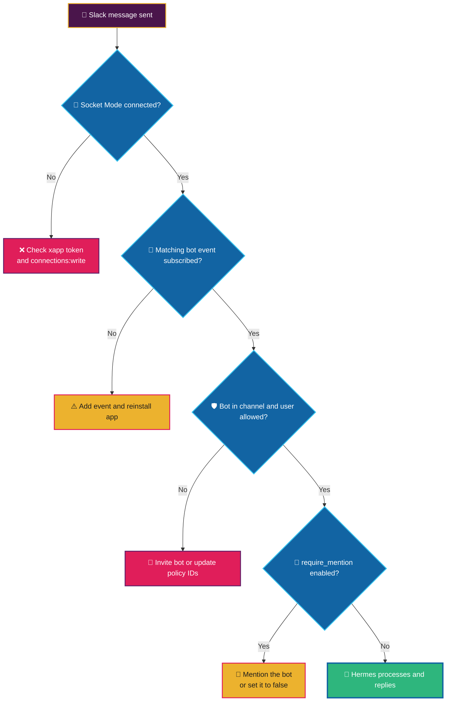

A Slack bot can successfully post a message, report that Socket Mode is connected, and still ignore every message you send it.

That combination feels contradictory at first. It is not. A Slack integration has several independent layers: credentials, Socket Mode connectivity, event delivery, authorization, and the bot's own response policy. A green light in one layer is not evidence that every other layer is healthy.

This post documents a practical investigation of a Hermes Agent Slack integration that could post into a channel but did not respond to messages in that same channel. The final cause was neither a broken token nor Socket Mode—it was a local policy setting that required every message to mention the bot.

> [!TIP]
> Treat **outbound posting**, **inbound Slack events**, and **Hermes response policy** as three separate things. Testing only one of them leaves a large blind spot.

## What you will learn

By the end of this post, you will know how to:

- Configure Slack Socket Mode using the correct app-level and bot tokens.
- Grant the bot the appropriate OAuth scopes without over-permissioning it.
- Subscribe to the correct Slack bot events for channels, private channels, DMs, and group DMs.
- Verify a Hermes gateway is connected to Slack without printing secrets.
- Check Slack user allowlists and channel identifiers.
- Diagnose why a healthy-looking bot ignores a message.
- Choose whether Hermes should reply only to `@mentions` or to normal messages in an approved channel.

## The benefit: a repeatable diagnostic path

The biggest benefit is not merely getting one bot working. It is being able to isolate the failing layer quickly the next time an integration is silent.

Instead of repeatedly changing scopes, replacing tokens, and restarting processes at random, you can verify each dependency in a deliberate order:

1. Is Slack connected?
2. Is Slack delivering the event?
3. Is Hermes allowed to receive it?
4. Is Hermes configured to reply to it?

That approach reduces both downtime and the temptation to grant broad, unnecessary Slack permissions.

## The architecture: five layers must agree

```mermaid
flowchart LR
    A["💬 A user sends a Slack message"]:::slack --> B["🔑 Slack app credentials"]:::token
    B --> C["🔌 Socket Mode connection"]:::socket
    C --> D["📨 Event subscription delivery"]:::event
    D --> E["🛡️ Hermes authorization and policy"]:::policy
    E --> F["🤖 Hermes processes and replies"]:::success

    classDef slack fill:#4A154B,color:#FFFFFF,stroke:#ECB22E,stroke-width:2px;
    classDef token fill:#1264A3,color:#FFFFFF,stroke:#36C5F0,stroke-width:2px;
    classDef socket fill:#611F69,color:#FFFFFF,stroke:#E01E5A,stroke-width:2px;
    classDef event fill:#ECB22E,color:#1D1C1D,stroke:#4A154B,stroke-width:2px;
    classDef policy fill:#2EB67D,color:#FFFFFF,stroke:#1264A3,stroke-width:2px;
    classDef success fill:#007A5A,color:#FFFFFF,stroke:#2EB67D,stroke-width:3px;
```



Each transition is a separate assertion. For example, Socket Mode can connect while Slack delivers no `message.channels` events. Likewise, Slack can deliver an event while Hermes deliberately declines to respond because the sender is not allowlisted or because a mention is required.

> [!IMPORTANT]
> A successful `chat.postMessage` test proves only that the bot can send a message. It does **not** prove that the bot can receive, authorize, or answer one.

## Slack prerequisites: tokens, scopes, and events

The terms **token scope** and **event subscription** are easy to mix up, but they have different jobs:

- **Scopes** grant the app permission to perform or access something.
- **Event subscriptions** tell Slack which incoming activity it should deliver to the app.

### 1. App-level token for Socket Mode

Create an app-level token that begins with `xapp-`. For Socket Mode, it needs this app-level scope:

```text
connections:write
```

Hermes uses this token to establish and maintain the Socket Mode WebSocket connection.

> [!WARNING]
> An `xapp-` token and an `xoxb-` token are not interchangeable. Do not put a second bot token in `SLACK_APP_TOKEN`.

### 2. Bot token scopes

The bot token begins with `xoxb-`. Grant only the scopes required for the Slack surfaces Hermes should monitor.

| Capability | Required Bot Token Scope |
|---|---|
| Send a reply | `chat:write` |
| Receive `@bot` mentions | `app_mentions:read` |
| Read messages in public channels | `channels:history` |
| Read messages in private channels | `groups:history` |
| Read direct messages | `im:history` |
| Read group direct messages | `mpim:history` |

For a typical public-channel Hermes deployment that responds to ordinary messages, the minimum useful set is:

```text
chat:write
channels:history
```

If the bot should respond only when mentioned, also include:

```text
app_mentions:read
```

Add the private-channel and DM scopes only when you deliberately want those conversation types supported.

> [!CAUTION]
> Do not add every scope "just in case." Least privilege makes a bot safer to operate, easier to review, and easier to explain to workspace administrators.

### 3. Bot events to subscribe to

In **Event Subscriptions → Subscribe to bot events**, add the events for the places where Hermes should listen:

| Slack surface | Subscribe to this bot event | Corresponding scope |
|---|---|---|
| A bot mention in a channel | `app_mention` | `app_mentions:read` |
| Public channels | `message.channels` | `channels:history` |
| Private channels | `message.groups` | `groups:history` |
| Direct messages | `message.im` | `im:history` |
| Group direct messages | `message.mpim` | `mpim:history` |

Slack's UI can show friendlier labels, but the official event identifiers are shown above. The `message.*` values are **events**, not OAuth scopes, so they will not appear in the Bot Token Scopes list.

After adding or changing bot scopes, **reinstall the app into the workspace** so Slack issues a token with the updated grants.

> [!WARNING]
> Adding a scope without reinstalling the Slack app leaves the existing bot token unchanged. The configuration may look correct while the running integration remains under-permissioned.

### 4. Channel membership still matters

Even with a valid token, event subscription, and `channels:history`, the bot must be invited to the channel it is meant to monitor.

For a public-channel bot, invite it explicitly:

```text
/invite @hermesagentwin
```

Replace the name with your bot's Slack handle.

## Hermes configuration: credentials, routing, and policy

In this case, the active Hermes profile was `blogger`, so the Slack configuration belonged in that profile's environment file—not in another profile or only in the global Hermes directory.

A typical profile-specific configuration includes:

```dotenv
SLACK_BOT_TOKEN=xoxb-...
SLACK_APP_TOKEN=xapp-...
SLACK_ALLOWED_USERS=U0123456789
SLACK_HOME_CHANNEL=C0123456789
SLACK_HOME_CHANNEL_NAME=hermes-channel
SLACK_ALLOW_ALL_USERS=false
```

A few details matter:

- `SLACK_ALLOWED_USERS` contains **Slack Member IDs**, not display names.
- `SLACK_HOME_CHANNEL` should contain the channel **ID**, not `#channel-name`.
- `SLACK_HOME_CHANNEL_NAME` is human-readable and should not include the leading `#`.
- Keeping `SLACK_ALLOW_ALL_USERS=false` makes the allowlist meaningful.

> [!TIP]
> Use the channel ID and Slack Member IDs for policy checks. Names can change; IDs are stable identifiers.

## Verify the connection without leaking secrets

Start by checking the active profile and gateway process:

```bash
hermes profile list
hermes --profile blogger gateway status
```

Then inspect the profile's gateway log for evidence of a working connection:

```bash
grep -iE 'slack|socket mode|authenticated|error|failed' \
  "$HOME/AppData/Local/hermes/profiles/blogger/logs/gateway.log" | tail -80
```

Healthy output should contain messages equivalent to:

```text
[Slack] Authenticated as @your-bot in workspace your-workspace
[Slack] Socket Mode connected (1 workspace(s))
✓ slack connected
```

You can also validate the bot token without displaying it:

```bash
curl -sS \
  -H "Authorization: Bearer $SLACK_BOT_TOKEN" \
  https://slack.com/api/auth.test
```

A successful response includes `"ok": true` and the expected workspace and bot user.

To confirm the bot can read the target channel history:

```bash
curl -sS -G \
  -H "Authorization: Bearer $SLACK_BOT_TOKEN" \
  --data-urlencode "channel=$SLACK_HOME_CHANNEL" \
  --data-urlencode "limit=10" \
  https://slack.com/api/conversations.history
```

This separates an inbound-event problem from a channel-access problem. If the recent user message appears in history but Hermes never replies, inspect Hermes authorization and response policy next.

> [!CAUTION]
> Never paste a raw Slack token into a chat, a blog post, source control, or diagnostic output. Commands should consume tokens from environment variables and display only API success or failure information.

## The investigation: what was working

The evidence showed that the integration was not fundamentally disconnected:

- The `blogger` gateway process was running.
- Slack authenticated the bot successfully.
- Socket Mode connected successfully.
- The bot could read the configured channel's history.
- The sender's Slack Member ID matched `SLACK_ALLOWED_USERS`.
- Recent user messages were visible in the target Slack channel.
- Hermes had posted outbound test and gateway-status messages before.

At this point, changing tokens or granting additional scopes would have been guesswork. The remaining question was simpler: **was Hermes configured to answer ordinary messages at all?**

## The hidden blocker: `require_mention`

The active profile contained this Slack policy:

```yaml
slack:
  require_mention: true
```

That setting makes sense in busy shared channels. It prevents a bot from responding to every passing conversation. But it also means a test message such as:

```text
Hi
```

is expected to receive no response.

The user must instead send a message that explicitly mentions the bot:

```text
@hermesagentwin Hi
```

Or, if the channel is intentionally dedicated to Hermes, change the policy:

```yaml
slack:
  require_mention: false
```

> [!IMPORTANT]
> The bot was not broken. It was obeying its configured conversation policy. This is why a full diagnostic must include local agent settings—not only Slack's app settings.

## Apply the fix and restart cleanly

For an approved dedicated channel, update the active profile configuration:

```bash
hermes --profile blogger config set slack.require_mention false
```

Configuration is read when the gateway starts, so restart the gateway afterward. From a shell that is **outside** the currently running gateway process:

```bash
hermes --profile blogger gateway restart
```

On Windows, if Hermes correctly refuses an in-process restart to avoid killing its own active session, stop the recorded gateway PID externally and trigger the scheduled gateway task for the relevant profile:

```bash
cmd.exe /c "taskkill /PID <GATEWAY_PID> /F"
cmd.exe /c "schtasks /Run /TN Hermes_Gateway_blogger"
```

Then verify the new process and Socket Mode connection:

```bash
hermes --profile blogger gateway status
```

Finally, send a **fresh** non-mention message in the configured channel:

```text
Hi Hermes, are you receiving this?
```

## A reusable decision tree



## Troubleshooting checklist

Use this checklist in order when Hermes is silent in Slack:

- [ ] The active Hermes profile is the one containing the Slack configuration.
- [ ] The profile's gateway process is running.
- [ ] `SLACK_APP_TOKEN` is an `xapp-...` token with `connections:write`.
- [ ] `SLACK_BOT_TOKEN` is an `xoxb-...` token.
- [ ] Bot Token Scopes match the conversation types Hermes should support.
- [ ] The matching bot events are subscribed in Slack.
- [ ] The Slack app was reinstalled after scope changes.
- [ ] Socket Mode is enabled.
- [ ] The bot is invited to the target channel.
- [ ] The target channel ID and approved Slack Member IDs are correct.
- [ ] `slack.require_mention` matches the intended user experience.
- [ ] The gateway was restarted after Hermes configuration or environment changes.
- [ ] The test message was sent after the gateway reconnected.

## Closing perspective

The useful lesson is not simply that `require_mention` can block a message. It is that integrations are policy systems as much as they are connectivity systems. A bot can be perfectly connected, securely configured, correctly authorized, and still appear silent because its behaviour is intentionally constrained.

---

Enjoy! Generated by AI Garrard (blogger) - chatgpt/gpt-5.6-terra

> The most difficult integration failures are often not broken connections—they are systems behaving exactly as configured, while we are testing them as though they were configured differently.
