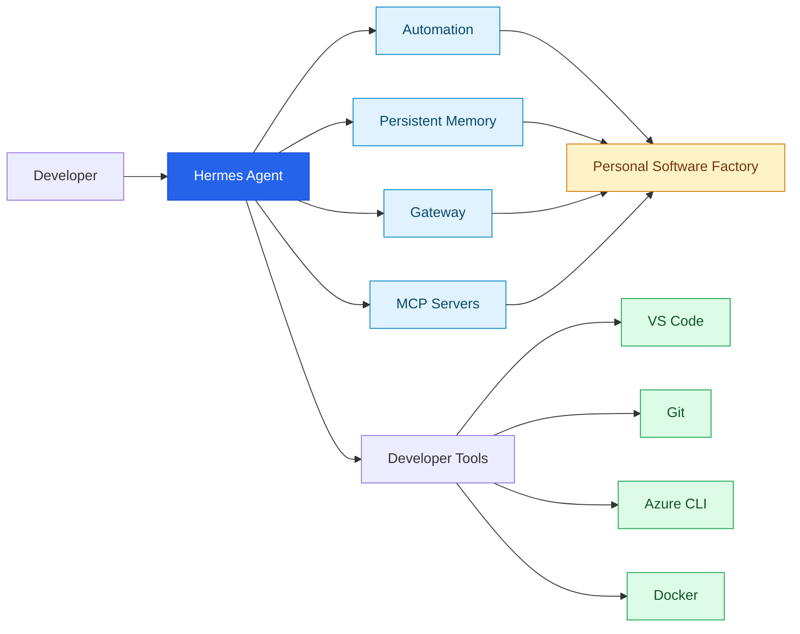
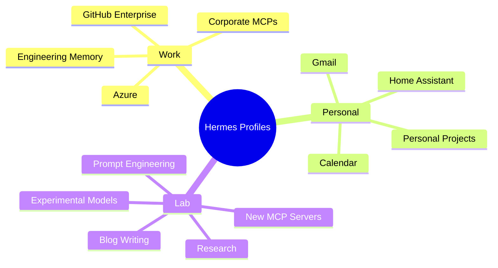
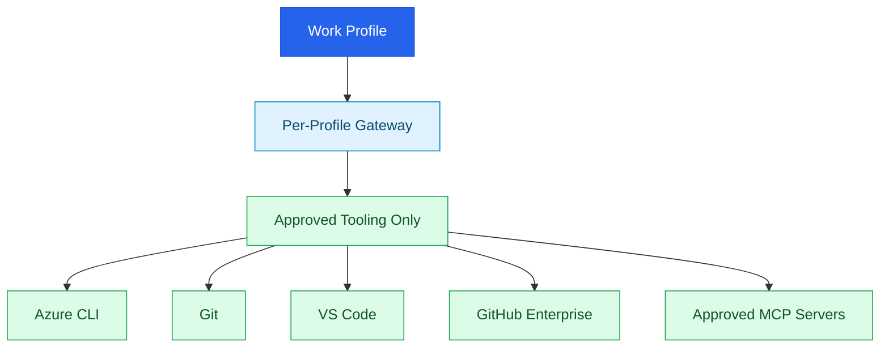
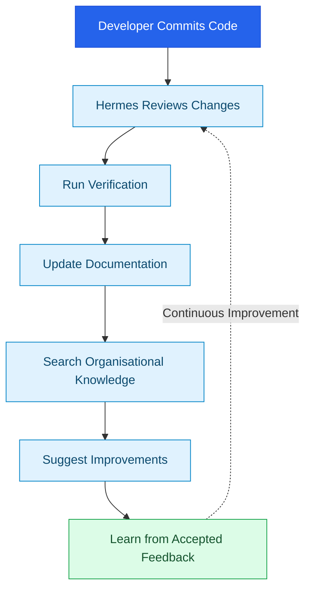

# Hermes Agent on Windows: Building Your Personal AI Software Factory

> [!Abstract]
> Most AI assistants answer questions. **Hermes Agent** goes much further—it remembers, learns, automates, connects to tools, and continuously improves the way it helps you. When combined with Model Context Protocol (MCP) servers, long-running gateways and automation loops, it starts to resemble a **personal software factory** rather than a chatbot.

---

# From Assistant to Autonomous Collaborator

We've spent the last few years interacting with AI by asking questions and waiting for answers.

Hermes Agent represents the next step.

Rather than being a stateless assistant, Hermes is an **AI agent runtime** capable of maintaining long-term context, connecting to external tools, interacting with MCP servers, executing tasks and building persistent knowledge over time.

Instead of asking:

> "Write me some code."

You move towards:

> "Understand my engineering standards, monitor my repositories, propose improvements, execute approved workflows and continually learn how I work."

That is a fundamental shift.

---

> [!Info]
> **Think of Hermes as an operating system for AI agents.**
>
> It combines:
>
> - Persistent memory
> - Tool execution
> - MCP integration
> - Long-running gateways
> - Profiles
> - Automation
> - Continuous learning
> - Workflow orchestration

---

# Why This Matters

Traditional AI sessions disappear when the conversation ends.

Hermes allows your agent to accumulate knowledge over time.

It can remember:

- Coding standards
- Architectural decisions
- Project context
- Engineering conventions
- Documentation
- Preferred workflows
- Domain knowledge

The result is less repetition and more intelligent collaboration.

---

# Beyond Memory: Self-Improving Systems

The real breakthrough isn't simply memory.

It's **feedback loops**.

Imagine an agent that:

1. Writes code
2. Executes tests
3. Reviews failures
4. Improves prompts
5. Updates documentation
6. Learns what worked
7. Performs better next time

Every completed task becomes another learning opportunity.

Instead of repeatedly solving the same problems, the system becomes progressively more capable.

This is where **adaptive intelligence** begins to emerge.

> [!Tip]
> Don't think in terms of **prompts**.
>
> Think in terms of **feedback loops**.
>
> Loops create improvement.
> Improvement creates capability.
> Capability creates leverage.

---

# Your Personal Software Factory

Most developers already possess the ingredients.

- Git
- VS Code
- Azure CLI
- Docker
- Local LLMs
- MCP Servers
- CI/CD
- Documentation
- Knowledge bases

Hermes provides the runtime that coordinates them into a single engineering system.

Instead of isolated tools, you gain an intelligent software factory capable of:

- Generating code
- Reviewing pull requests
- Producing documentation
- Querying architectural knowledge
- Running tests
- Creating diagrams
- Managing cloud resources
- Automating repetitive engineering work

---

## A Personal Software Factory



---

# The Importance of Profiles

One mistake people often make is creating too many profiles.

Profiles are **not folders**.

They are isolated execution environments containing their own:

- Memory
- Configuration
- Authentication
- MCP Servers
- Tools
- SOUL
- Gateway

A profile should represent a distinct **identity**, **trust boundary** or **working context**.

## Recommended Layout



> [!Success]
> Create a new profile only when one or more of these changes:
>
> - Identity
> - Security boundary
> - Domain knowledge
> - Tooling
> - Risk level

---

# Running Hermes on Windows

Hermes works extremely well as a native Windows application.

Rather than manually launching the gateway each time you sign in, install the gateway for each profile and let Windows start it automatically.

Benefits include:

- Automatic startup
- Long-running availability
- Persistent memory
- Immediate connectivity from VS Code and other clients
- No manual intervention

> [!Tip]
> For a developer workstation, a **per-user gateway** is generally preferable to running Hermes as a Windows Service.
>
> It naturally inherits your user credentials, Azure CLI login, Git authentication and local environment.

---

# Getting Started on Windows

The following PowerShell commands create a native Windows installation, three isolated profiles, and a gateway for each profile. Open a new PowerShell or Windows Terminal tab after installation so the updated user `PATH` is available.

> [!Warning]
> Treat each profile as a security boundary. Keep API keys and messaging tokens in that profile's `.env` file, never commit them to source control, and use distinct bot tokens for gateways that run at the same time. File-system permissions can reduce casual access, but they do not encrypt secrets or protect them if the account, device, or profile is compromised. See [Making `.env` Files Secure](https://blog.garrardkitchen.com/blog/making-env-files-secure/).

## Install and Verify

```powershell
# Install Hermes Agent for the current Windows user.
iex (irm https://raw.githubusercontent.com/NousResearch/hermes-agent/main/scripts/install.ps1)

# Run these in a new PowerShell window after the installer completes.
Get-Command hermes
hermes --version
```

## Create and Configure Profiles

```powershell
# Create isolated profiles. Use --clone only when the source profile contains
# configuration you deliberately want to reuse.
hermes profile create work
hermes profile create personal
hermes profile create lab

# Configure each profile independently. --portal is optional; use it when
# you have a Nous Portal subscription.
hermes -p work setup --portal
hermes -p personal setup --portal
hermes -p lab setup --portal

# Optional: make work the default profile for future Hermes commands.
hermes profile use work
```

## Start Gateways Automatically at Sign-in

```powershell
# Install a per-profile Windows Scheduled Task for each gateway.
hermes -p work gateway install
hermes -p personal gateway install
hermes -p lab gateway install

# Start each installed gateway now; it will also start automatically when you sign in.
hermes -p work gateway start
hermes -p personal gateway start
hermes -p lab gateway start
```

## Use and Monitor Profiles

```powershell
# Start an interactive session in a specific profile.
hermes -p work chat
hermes -p personal chat
hermes -p lab chat

# Review the active profile, or every profile gateway in one view.
hermes -p work gateway status
hermes gateway list

# Restart every installed gateway after an update, if required.
hermes update
hermes gateway restart --all
```

> [!Tip]
> Each created profile also has a command alias, so `work chat` and `work gateway start` are equivalent to using `hermes -p work`.

---

# Updating Hermes Across Profiles and Gateways

Hermes has one shared installation but maintains configuration, memories, sessions, skills and gateway state per profile. Update the shared runtime once; Hermes then synchronises bundled skills to all profiles while preserving user-modified skills.

```powershell
# Review whether an update is available before changing the installation.
hermes update --check

# Take a Hermes-home snapshot, then update the shared runtime.
hermes update --backup

# Restart every installed profile gateway so each uses the updated runtime.
hermes gateway restart --all

# Confirm that all profile gateways are healthy.
hermes gateway list
```

> [!Tip]
> Update first in the **lab** profile workflow, validate the integrations you rely on, then roll the update into your regular work and personal use. For a work profile, follow your organisation's software-update and change-control policy.

> [!Warning]
> An update preserves profile data, but it can change runtime behaviour or bundled skills. Keep exportable backups of important profiles and review release notes before upgrading production or corporate configurations.

---

# Corporate Laptops: Keep the Work Boundary Intact

On a managed corporate laptop, treat Hermes like any other developer platform: install it once for the signed-in user, run a **work** profile through its own auto-starting gateway, and connect it only to tools approved by your organisation.

If your setup allows it, prefer a bastion tunnel to a remote Hermes host rather than exposing the agent directly to the corporate network. That keeps access constrained to an approved entry point while preserving network boundaries and auditability.

When policy is stricter, the cleaner option is a separate device that is not domain-joined or otherwise enrolled in corporate management. That reduces the risk of corporate data ending up on personal or shared drives, and it avoids cross-contamination between work credentials, cached files, and local storage.

> [!Important]
> Obtain approval from your security, privacy and IT teams before connecting Hermes to corporate repositories, tenants, MCP servers, or data. A profile is an isolation mechanism, not a substitute for organisational controls such as least privilege, data classification, endpoint management, audit logging, and acceptable-use policies.



Keep personal services out of the work profile, including personal email, home automation, personal source-control accounts, and consumer API credentials. Place those in a separate **personal** profile—or do not configure them on the corporate device if policy prohibits it.

## Why a Per-User Scheduled Task Is Usually Better Than a Windows Service

For a developer workstation, use Hermes' per-user gateway installation rather than wrapping it with `NSSM`, `WinSW`, or `sc.exe`. On Windows, Hermes uses a Scheduled Task and can fall back to the Startup folder when Scheduled Tasks are blocked. This lets the gateway start at sign-in under the user's normal identity, retaining access to approved developer credentials and tools without adding administrator-level service management.

Reserve a Windows Service for server-style scenarios: a dedicated machine that must run while nobody is signed in, or a deliberately designed shared service with appropriate identity, secret-management, network, monitoring, and operational controls.

> [!Tip]
> Use a separate **lab** profile for new MCP servers, models, and prompt experiments. Promote only reviewed, approved integrations into the work profile.

---

# Building Intelligent Feedback Loops

Once your gateway is always running, interesting possibilities emerge.



Now extend that across:

- Multiple repositories
- Multiple teams
- Multiple business units

You're no longer automating individual tasks.

You're automating engineering itself.

---

# The Emerging Pattern

Across the industry, a clear evolution is taking shape.

```mermaid
flowchart LR

GenAI["Generative AI"]
Assistants["AI Assistants"]
Agents["AI Agents"]
Engineering["Agentic Engineering"]
Integrated["Integrated Intelligence"]
Adaptive["Adaptive Intelligence"]
Enterprise["Autonomous Enterprise"]

GenAI --> Assistants
Assistants --> Agents
Agents --> Engineering
Engineering --> Integrated
Integrated --> Adaptive
Adaptive --> Enterprise

classDef foundation fill:#E0F2FE,stroke:#0284C7,color:#0C4A6E
classDef evolution fill:#DBEAFE,stroke:#2563EB,color:#1E3A8A
classDef destination fill:#F3E8FF,stroke:#9333EA,color:#581C87
class GenAI,Assistants foundation
class Agents,Engineering,Integrated,Adaptive evolution
class Enterprise destination
```



Each stage introduces:

- Richer context
- Greater autonomy
- Better orchestration
- Stronger feedback loops
- Higher-quality decision making

Hermes fits squarely into the transition from **AI Agents** towards **Integrated Intelligence**, where people, tools, memory, workflows and automation operate as a coordinated system.

---

> [!Important]
> The competitive advantage isn't simply using AI.
>
> It's building systems that continuously **learn**, **adapt** and **improve**.

---

# Looking Ahead

Hermes is much more than another AI client.

It provides the foundation for building an intelligent engineering ecosystem.

Treat your agent like another member of the engineering team:

- Give it persistent memory
- Connect it to trusted tools
- Build automation loops
- Capture engineering knowledge
- Continuously refine its behaviour
- Allow it to learn from outcomes

Eventually something subtle happens.

You're no longer asking an AI for help.

You're collaborating with a system that has been learning alongside your team for months.

That is the transition from **AI assistance** to **engineering intelligence**.

---

> [!Quote]
> **The future won't belong to the organisations with the biggest models.**
>
> **It will belong to those that build the best learning systems around them.**


