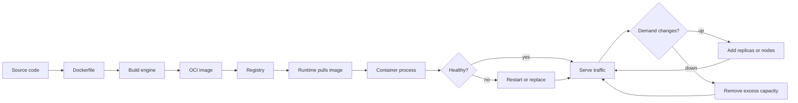
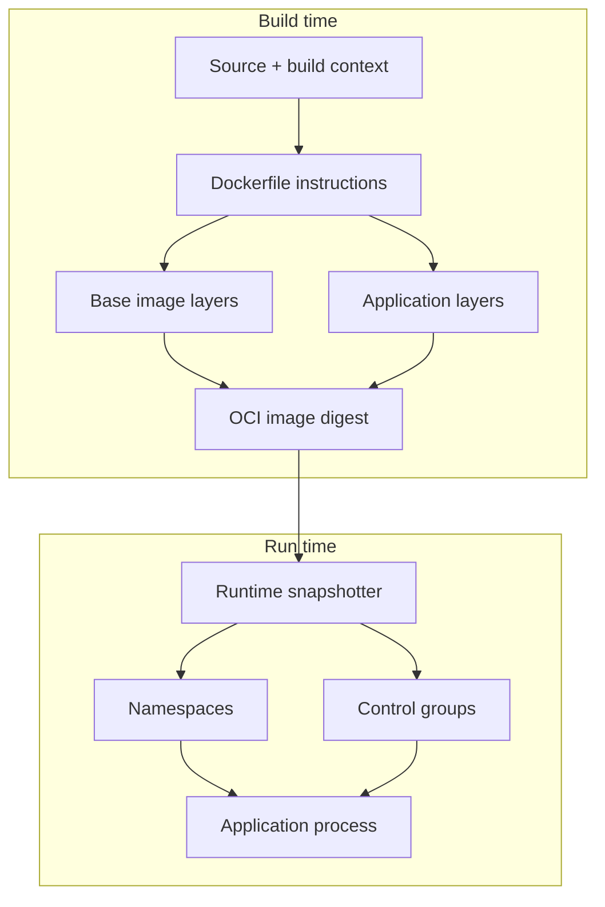
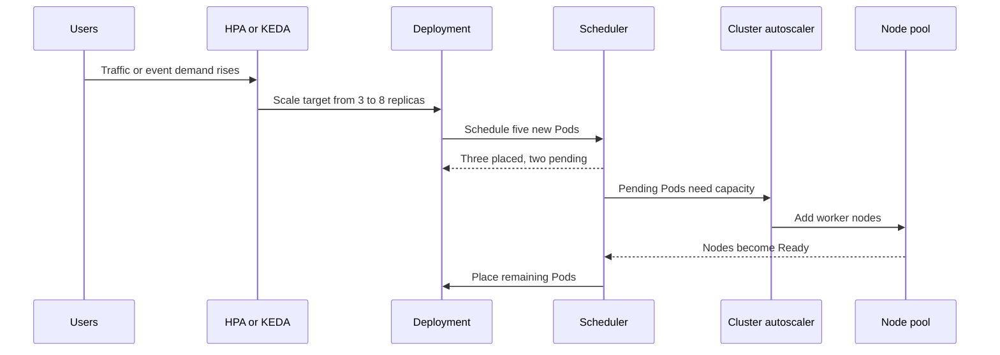

Containers are often introduced as “a lightweight way to package an application.” That is true, but incomplete. The interesting engineering question begins after the image has been built:

**Who decides where the container runs, who notices when it dies, who replaces it, and who adds capacity when demand rises?**

This article follows a container through its whole life—from source code and Dockerfile, to image, to runtime process, to scheduled workload, to recovery and scale. We will compare Docker Desktop, Podman, Kubernetes, and Azure Kubernetes Service (AKS); map their capabilities; build secure images; and finish with GitHub Actions and GitLab CI/CD examples.

> [!Tip]
> Keep this mental model: **an image is a package, a container is a process, and an orchestrator is a control loop that continually compares desired state with reality.**

## Why this matters

A container can start successfully and still fail as a service. It may have no health check, no restart policy, no replica controller, no resource request, no graceful shutdown path, or no safe image promotion process. Those omissions only become visible under failure or traffic—usually when the system is already under pressure.

Understanding the layers helps you choose the simplest platform that meets the reliability requirement:

- A developer laptop needs fast feedback and convenient local networking.
- A single server may need rootless containers and a host-level service manager.
- A production cluster needs scheduling, rollouts, replica management, disruption handling, and observability.
- A managed service such as AKS adds Azure-managed control-plane operations and integrations, but does not remove workload responsibility.

## The container lifecycle in one picture



For readers who prefer a visual map of responsibility, this SVG separates the four layers that are often mistakenly treated as one thing:

<svg xmlns="http://www.w3.org/2000/svg" viewBox="0 0 900 250" role="img" aria-labelledby="container-layer-title container-layer-desc">
  <title id="container-layer-title">Container platform responsibility layers</title>
  <desc id="container-layer-desc">Four connected layers: image, runtime, orchestrator, and cloud platform.</desc>
  <defs>
    <linearGradient id="g1" x1="0" x2="1"><stop offset="0" stop-color="#0f766e"/><stop offset="1" stop-color="#14b8a6"/></linearGradient>
    <linearGradient id="g2" x1="0" x2="1"><stop offset="0" stop-color="#1d4ed8"/><stop offset="1" stop-color="#60a5fa"/></linearGradient>
    <linearGradient id="g3" x1="0" x2="1"><stop offset="0" stop-color="#7c3aed"/><stop offset="1" stop-color="#a78bfa"/></linearGradient>
    <linearGradient id="g4" x1="0" x2="1"><stop offset="0" stop-color="#b45309"/><stop offset="1" stop-color="#f59e0b"/></linearGradient>
    <marker id="arrow" markerWidth="10" markerHeight="10" refX="8" refY="3" orient="auto"><path d="M0,0 L0,6 L9,3 z" fill="#475569"/></marker>
  </defs>
  <rect width="900" height="250" rx="18" fill="#f8fafc"/>
  <g font-family="system-ui, sans-serif" text-anchor="middle">
    <rect x="35" y="75" width="175" height="100" rx="14" fill="url(#g1)"/>
    <rect x="245" y="75" width="175" height="100" rx="14" fill="url(#g2)"/>
    <rect x="455" y="75" width="175" height="100" rx="14" fill="url(#g3)"/>
    <rect x="665" y="75" width="200" height="100" rx="14" fill="url(#g4)"/>
    <g fill="white">
      <text x="122" y="108" font-size="20" font-weight="700">Image</text><text x="122" y="135" font-size="14">package + metadata</text><text x="122" y="157" font-size="13">Dockerfile / OCI</text>
      <text x="332" y="108" font-size="20" font-weight="700">Runtime</text><text x="332" y="135" font-size="14">process + isolation</text><text x="332" y="157" font-size="13">Docker / Podman</text>
      <text x="542" y="108" font-size="20" font-weight="700">Orchestrator</text><text x="542" y="135" font-size="14">placement + repair</text><text x="542" y="157" font-size="13">Kubernetes</text>
      <text x="765" y="108" font-size="20" font-weight="700">Cloud platform</text><text x="765" y="135" font-size="14">nodes + managed ops</text><text x="765" y="157" font-size="13">AKS / Azure</text>
    </g>
    <g stroke="#475569" stroke-width="3" marker-end="url(#arrow)"><line x1="215" y1="125" x2="238" y2="125"/><line x1="425" y1="125" x2="448" y2="125"/><line x1="635" y1="125" x2="658" y2="125"/></g>
    <text x="450" y="38" font-size="17" fill="#0f172a" font-weight="700">Each layer owns a different promise</text>
  </g>
</svg>

There are three different operations hidden in this diagram:

1. **Creation** turns a Dockerfile and build context into an immutable image.
2. **Execution** turns an image into one or more isolated processes.
3. **Orchestration** keeps a declared number of healthy processes available on suitable machines.

## 1. How containers are created

### The image is a filesystem plus metadata

A container image is normally an OCI-compatible bundle of read-only filesystem layers and configuration metadata. A `RUN` instruction may create a layer; `COPY` adds application files; `ENTRYPOINT` and `CMD` describe the process to start; environment, user, working directory, and exposed ports become runtime metadata.

The build engine does not “copy a running computer.” It assembles a reproducible artifact. At runtime, the engine adds a thin writable layer and starts a process with Linux namespaces and control groups (or the corresponding virtualized mechanism on a desktop host).



### Build context is part of the product

The build context is everything sent to the build engine. A careless context can include `.git`, secrets, test output, credentials, and large dependency caches. A `.dockerignore` file is therefore both a performance control and a security boundary.

### Tags are labels; digests are identities

`my-app:1.4.0` is a human-friendly tag that can move. `my-app@sha256:...` identifies exact image content. Build pipelines should produce useful tags for humans but deploy immutable digests whenever the platform supports it.

## 2. How containers are scheduled

Scheduling means selecting a host for a workload. The answer depends entirely on the platform.

### Docker Desktop

Docker Desktop runs a Linux VM on macOS and Windows, while Linux can use the native engine. A local `docker run` starts a container through the Docker Engine; there is no cluster-wide scheduler deciding among many worker nodes unless Docker Desktop Kubernetes is explicitly enabled.

Compose adds application-level coordination: services, networks, volumes, dependencies, and replica-style commands. It is excellent for a repeatable local stack, but it is not a substitute for production orchestration. A Compose restart policy can restart a process on the same local engine; it does not provide Kubernetes-style placement across failure domains.

### Podman

Podman is a daemonless, OCI-oriented container engine with a Docker-compatible command style. It is especially attractive for rootless development and single-host operation. A Podman pod groups containers that share a network namespace, much like the pod concept Kubernetes popularised.

Podman can be paired with systemd/Quadlet for boot-time startup, restart, dependency ordering, and host-level service management. That is a strong single-node pattern, but the scheduling domain remains the host unless Podman is integrated with a broader orchestrator.

### Kubernetes

Kubernetes schedules Pods, not raw containers. A Deployment expresses a desired number of interchangeable Pods; the scheduler filters and scores nodes using resource requests, selectors, taints, affinity, topology constraints, and available capacity. The kubelet on the chosen node then asks the container runtime to pull the image and create the containers.

The scheduler makes a placement decision, but the controllers keep making corrections. If a Pod disappears, the Deployment/ReplicaSet creates a replacement. If a node fails, the control plane eventually reschedules eligible workload replicas elsewhere.

### AKS

AKS is managed Kubernetes. Azure manages the Kubernetes control plane and provides Azure-specific integrations, while customer-managed agent nodes run workloads. The Kubernetes scheduler and controllers still define workload behavior; AKS adds managed node-pool operations, Azure identity/networking/storage options, monitoring integrations, upgrade channels, and autoscaling choices.

> [!Note]
> AKS reduces control-plane and platform toil; it does not make an application stateless, highly available, observable, or correctly sized by default.

## 3. How containers are kept running

“Keep it running” has several meanings:

| Layer | What is monitored | Typical response |
|---|---|---|
| Process | Exit code, signal, runtime state | Restart the same container |
| Container | Liveness/readiness health | Restart, remove from traffic, or replace |
| Pod/workload | Replica count and rollout state | Create replacement Pods |
| Node | Kubelet/node health and capacity | Drain, repair, or reschedule |
| Cluster | Pending workloads and capacity | Add nodes or change placement |

In Docker, `--restart=unless-stopped` can restart an exited container. In Podman, systemd or Quadlet can provide a durable service unit. In Kubernetes, a container restart is usually the kubelet’s job, while a missing Pod is the controller’s job. In AKS, node and control-plane operations add another managed reliability layer.

### Health checks are contracts, not decoration

A liveness probe answers: “Should this process be restarted?” A readiness probe answers: “Should this instance receive traffic?” A startup probe answers: “Has this slow-starting process finished booting?”

Do not use a deep dependency check as liveness unless restarting the application is genuinely the right response. A temporary database outage should often make the application unready—not cause every replica to restart in a loop.

### Graceful termination matters

When a container is stopped, the runtime sends a signal and eventually forces termination after a grace period. Applications should stop accepting new work, finish or cancel in-flight requests, flush important telemetry, and exit. Kubernetes termination hooks and `terminationGracePeriodSeconds` help, but they cannot compensate for an application that ignores signals.

## 4. How containers are scaled

### Scale out the application

Horizontal scaling creates more replicas. It is usually the safest first response for stateless HTTP workloads, provided that sessions, files, queues, and caches are externalised or deliberately partitioned.

### Scale up the container

Vertical scaling gives a replica more CPU or memory. It can help workloads that cannot split easily, but it may require a restart and can hide an inefficient application.

### Scale the cluster

If there is no room for a new Pod, adding replicas alone does nothing. A node autoscaler watches for unschedulable Pods and adds nodes; it can later remove underutilised nodes when workloads can be safely moved.



Kubernetes HPA adjusts a workload’s replica count from metrics such as CPU, memory, or custom metrics. KEDA can scale from external events such as queue depth. AKS can combine Pod autoscaling with cluster autoscaling or node autoprovisioning. Resource requests are crucial: the scheduler and node autoscaler reason about requested capacity, not merely what the process happens to consume at a moment in time.

## 5. How containers recover

Recovery is a chain of increasingly broad control loops:

1. **Process recovery:** restart an exited process.
2. **Instance recovery:** replace a failed or unready container/Pod.
3. **Node recovery:** move workloads away from an unhealthy node.
4. **Capacity recovery:** add nodes when replicas cannot be placed.
5. **Data recovery:** restore state from durable storage, replication, or backups.

The last step is often forgotten. Kubernetes can recreate a Pod, but it cannot reconstruct data that was only stored in an ephemeral filesystem. Databases, uploaded files, queues, and encryption keys need explicit durability and recovery designs.

> [!Warning]
> Replica recovery is not disaster recovery. Three replicas on one failed node, zone, or region are still one failure domain.

Use PodDisruptionBudgets, topology spread constraints, multiple availability zones, rolling-update limits, and application-level timeouts to make recovery survivable rather than merely automatic.

## 6. Feature-alignment matrix

The table below describes the normal shape of each platform. “Native” means the platform provides the primitive directly; “add-on” means another component or service is commonly required.

| Capability | Docker Desktop | Podman | Kubernetes | AKS |
|---|---|---|---|---|
| Build OCI/Docker images | Native | Native | Usually external build system | Usually external build system |
| Run one container | Native | Native | Via Pod/ workload object | Via Pod/ workload object |
| Multi-container local app | Compose | Pods/Compose compatibility | Native Pods, Services | Native Pods, Services |
| Multi-node scheduling | Optional local Kubernetes | Not a core single-host feature | Native scheduler | Native scheduler, Azure-managed control plane |
| Restart failed process | Restart policy | systemd/Quadlet or restart policy | Kubelet | Kubelet plus AKS node operations |
| Replace missing replicas | Limited | Host-level automation | Deployment/StatefulSet/Job controllers | Kubernetes controllers |
| Service discovery | Compose network/DNS | Network/DNS configuration | Services/CoreDNS | Services/CoreDNS plus Azure networking options |
| Rolling deployment | Compose workflows or external tooling | External tooling/systemd patterns | Deployment controller | Kubernetes Deployment plus AKS integrations |
| Horizontal Pod/container scaling | Compose scale/manual | Manual or external tooling | HPA/KEDA add-ons | HPA/KEDA supported; AKS options simplify operations |
| Node autoscaling | Not normally | Not normally | Add cluster autoscaler | Cluster autoscaler and optional node autoprovisioning |
| Rootless operation | Desktop VM isolation; engine depends on host | Strong native workflow | Pod security and runtime configuration | Pod security, Azure identity, policy |
| Persistent storage | Bind mounts/volumes | Volumes and mounts | PV/PVC/storage classes | Azure Disk, Azure Files, CSI drivers, and more |
| Secrets | Local secret mechanisms vary | Secret objects/local integrations | Secrets, external secret systems | Kubernetes Secrets plus Key Vault integrations |
| Self-healing scope | Container/process | Container/process/host service | Workload, Pod, and node-aware controllers | Kubernetes plus managed Azure operations |
| Best fit | Local development and demos | Rootless local or single-host services | Portable production orchestration | Production Kubernetes on Azure |

The matrix is a decision aid, not a promise that every desktop edition, runtime, or add-on has identical behavior. Pin versions and verify the exact platform profile before treating an optional feature as a baseline.

## 7. Dockerfile best practices

### Use a small, intentional build

```dockerfile
# syntax=docker/dockerfile:1

FROM mcr.microsoft.com/dotnet/sdk:10.0 AS build
WORKDIR /src

# Copy dependency manifests first to improve cache reuse.
COPY src/Example.Api/Example.Api.csproj src/Example.Api/
RUN dotnet restore src/Example.Api/Example.Api.csproj

COPY . .
RUN dotnet publish src/Example.Api/Example.Api.csproj \
    --configuration Release \
    --output /out \
    --no-restore \
    --no-self-contained

FROM mcr.microsoft.com/dotnet/aspnet:10.0 AS runtime
WORKDIR /app

RUN useradd --create-home --uid 10001 appuser
COPY --from=build --chown=appuser:appuser /out ./
USER appuser

ENV ASPNETCORE_HTTP_PORTS=8080
EXPOSE 8080
ENTRYPOINT ["dotnet", "Example.Api.dll"]
```

The exact base image should match the application’s supported runtime. Pin a tested version or digest, update it deliberately, and scan it. Do not copy compilers, package managers, source code, test data, or credentials into the runtime stage.

### A practical checklist

- Use multi-stage builds so the runtime image contains only runtime assets.
- Choose a supported, minimal base image; document why it is appropriate.
- Add a `.dockerignore` that excludes source-control metadata, secrets, build output, and local caches.
- Order layers from least frequently changing to most frequently changing.
- Combine related package installation and cleanup in one layer.
- Run as a non-root user whenever the application permits it.
- Prefer `COPY` over `ADD` unless archive extraction or remote-source semantics are intentional.
- Use exec-form `ENTRYPOINT`/`CMD` so signals reach the application.
- Do not bake secrets into layers; inject them at runtime through a secret manager.
- Add OCI labels such as source, revision, version, licenses, and creation time.
- Build with `--pull`, test the resulting image, and scan both the image and its dependencies.
- Publish by immutable digest and retain provenance/attestation where available.

Docker’s own guidance emphasises multi-stage builds, sensible base images, `.dockerignore`, cache use, non-root execution, and CI image testing. These are portable OCI practices even when the final runtime is Podman or Kubernetes.

## 8. Container security: make compromise harder

Container isolation is useful, but it is not a security boundary that should be trusted blindly. Containers share the host kernel, and a container process may become a serious host or supply-chain risk when it runs with excessive privileges, has access to the Docker socket, contains secrets, or uses an untrusted and outdated base image.

OWASP’s Docker Security Cheat Sheet and Kubernetes Security Cheat Sheet point to the same core principle: **least privilege must apply to the image, the process, the runtime, and the platform configuration.**

### Never make root the default application user

The Dockerfile should perform privileged build operations—such as installing OS packages—as `root` only when necessary, then switch permanently to an unprivileged runtime user. Do not add `sudo` to the runtime image to compensate for a poor ownership model.

```dockerfile
FROM mcr.microsoft.com/dotnet/aspnet:10.0 AS runtime
WORKDIR /app

# Use a fixed identity so file ownership and policy are predictable.
RUN groupadd --system --gid 10001 appgroup \
    && useradd --system --uid 10001 --gid appgroup --no-log-init appuser

COPY --from=build --chown=appuser:appgroup /out ./

# Everything after this point runs without root privileges.
USER 10001:10001

ENTRYPOINT ["dotnet", "Example.Api.dll"]
```

The `USER` instruction establishes the image default, but the runtime or orchestrator should enforce it too. In Kubernetes, add `runAsNonRoot: true`, an explicit `runAsUser`, and `allowPrivilegeEscalation: false`. This protects against a later image or deployment change silently restoring root execution.

```yaml
securityContext:
  runAsNonRoot: true
  runAsUser: 10001
  runAsGroup: 10001
  allowPrivilegeEscalation: false
  readOnlyRootFilesystem: true
  capabilities:
    drop: ["ALL"]
  seccompProfile:
    type: RuntimeDefault
```

### OWASP-aligned Dockerfile and image controls

- **Use a trusted, minimal base image.** Prefer a documented official image or verified publisher. A smaller runtime stage removes shells, compilers, package managers, and debugging tools that an attacker could use after a compromise.
- **Pin what you build from.** Use a reviewed version and, for reproducible production builds, pin `FROM` references to a digest. Pair pinning with an update process so security fixes do not become permanently frozen.
- **Do not use `latest`.** It is mutable, makes rollbacks ambiguous, and hides which artifact was tested.
- **Keep secrets out of Dockerfiles and layers.** Never pass passwords, tokens, certificates, or private package credentials through `ARG` or `ENV`. Use BuildKit secret mounts for build-time access and a secret manager for runtime access.
- **Keep secrets out of the build context.** Use `.dockerignore`, review the context, and scan the image filesystem and history for credentials.
- **Do not expose the Docker socket.** Mounting `/var/run/docker.sock` into a container is effectively giving that container broad control over the host’s Docker engine; read-only mounting does not make this safe.
- **Do not use `--privileged`.** It grants a broad set of kernel capabilities and weakens isolation. Drop all capabilities by default and add only a narrowly justified capability.
- **Keep the root filesystem read-only where possible.** Use a dedicated writable volume or `tmpfs` for the few paths that genuinely need writes.
- **Retain default seccomp/AppArmor/SELinux protections.** Start from the runtime’s default profile and tighten it for the workload; never disable the profile as a troubleshooting shortcut.
- **Scan continuously.** Scan source dependencies, the built image, base-image updates, IaC, and secrets. Fail builds for defined severity thresholds, with documented exceptions rather than blanket suppression.
- **Prove provenance and integrity.** Publish SBOMs and build attestations, sign images where appropriate, and deploy by digest after admission checks.
- **Patch the host and runtime.** Containers share the host kernel, so Docker/Podman, Kubernetes nodes, and operating-system security updates remain part of the threat model.

### Security is a runtime property too

The Dockerfile cannot enforce every production control. At runtime, also configure non-root execution, capability dropping, read-only filesystems, network policy, resource limits, restricted service-account permissions, encrypted secrets, and admission policy. In Kubernetes, use the Restricted Pod Security standard or an equivalent policy baseline, and disable automatic service-account token mounting for workloads that do not call the Kubernetes API.

> [!Warning]
> “The image runs as non-root” is necessary but not sufficient. A privileged container, a mounted Docker socket, host-path access, excessive capabilities, or a compromised node can still defeat the intended isolation.

## 9. Container runtime best practices

### Make the process disposable

Treat the container filesystem as ephemeral. Write durable state to a managed volume or external service. Keep one main responsibility per container where practical, and send logs to standard output/error so the platform can collect them.

### Set resource boundaries

On a local engine, set CPU and memory limits for realistic testing. In Kubernetes, set requests and limits deliberately:

- Requests influence scheduling and autoscaling.
- Limits protect the node but can cause throttling or out-of-memory kills.
- Missing requests make capacity planning and autoscaler behavior less predictable.

### Reduce blast radius

Use a non-root user, drop unnecessary Linux capabilities, use a read-only root filesystem where possible, avoid privileged mode, and apply seccomp/AppArmor or equivalent runtime profiles. Keep images current and remove unused packages.

### Design for shutdown and failure

Use timeouts, retries with backoff and jitter, circuit breakers, idempotent handlers, bounded queues, and graceful shutdown. A restart loop is not resilience; it is a symptom until the underlying failure is understood.

### Observe the four signals

Collect latency, traffic, errors, and saturation. Add container restart counts, probe failures, pending Pods, image-pull failures, OOM kills, node pressure, and queue depth. Alert on user impact and sustained symptoms, not every transient restart.

## 10. GitHub tooling that helps

GitHub provides a natural path from source to a signed or attested image:

- GitHub Actions runs build, test, scan, and release workflows.
- GitHub Container Registry (GHCR) stores OCI images beside the repository.
- Dependabot can raise updates for dependencies and actions.
- Code scanning and SARIF integrations surface code and configuration findings.
- Environments, reviewers, and protected branches gate production deployment.
- Artifact attestations can establish build provenance for published images.
- Docker Buildx and BuildKit provide cache export, multi-platform builds, and efficient multi-stage builds.

Pin third-party Actions to commit SHAs in security-sensitive workflows, keep permissions minimal, and use a short-lived workload identity for cloud deployment rather than a long-lived cloud secret.

### Sample GitHub Actions pipeline

```yaml
name: container

on:
  pull_request:
  push:
    branches: [main]

env:
  REGISTRY: ghcr.io
  IMAGE_NAME: ${{ github.repository }}

jobs:
  build-test-publish:
    runs-on: ubuntu-latest
    permissions:
      contents: read
      packages: write
      attestations: write
      id-token: write
    steps:
      - name: Check out source
        uses: actions/checkout@v6

      - name: Set up Buildx
        uses: docker/setup-buildx-action@v3

      - name: Log in to GHCR
        if: github.event_name == 'push'
        uses: docker/login-action@v3
        with:
          registry: ${{ env.REGISTRY }}
          username: ${{ github.actor }}
          password: ${{ secrets.GITHUB_TOKEN }}

      - name: Build and test image
        uses: docker/build-push-action@v6
        with:
          context: .
          load: true
          tags: local/example:${{ github.sha }}
          cache-from: type=gha
          cache-to: type=gha,mode=max

      - name: Run container smoke test
        run: |
          docker run -d --name example -p 8080:8080 local/example:${{ github.sha }}
          for i in {1..30}; do curl --fail http://localhost:8080/health && exit 0; sleep 2; done
          docker logs example
          exit 1

      - name: Build and publish immutable image
        if: github.event_name == 'push'
        id: push
        uses: docker/build-push-action@v6
        with:
          context: .
          push: true
          tags: ${{ env.REGISTRY }}/${{ env.IMAGE_NAME }}:${{ github.sha }}
          labels: |
            org.opencontainers.image.source=https://github.com/${{ github.repository }}
            org.opencontainers.image.revision=${{ github.sha }}
          cache-from: type=gha
          cache-to: type=gha,mode=max

      - name: Generate provenance attestation
        if: github.event_name == 'push'
        uses: actions/attest-build-provenance@v2
        with:
          subject-name: ${{ env.REGISTRY }}/${{ env.IMAGE_NAME }}
          subject-digest: ${{ steps.push.outputs.digest }}
          push-to-registry: true
```

For production, pin the action references to reviewed commit SHAs; the version tags above keep the example readable.

## 11. GitLab tooling that helps

GitLab’s integrated path includes:

- GitLab CI/CD pipelines defined in `.gitlab-ci.yml`.
- The GitLab Container Registry for project-scoped images.
- Dependency scanning, SAST, secret detection, and container scanning templates.
- BuildKit/buildx or Buildah when Docker-in-Docker is not the right trade-off.
- Protected branches, environments, deployment approvals, and review apps.
- Dependency Proxy to reduce external registry rate-limit pressure.
- Kubernetes agents and deployment integrations for cluster delivery.

Docker-in-Docker is familiar, but it needs careful runner isolation and commonly requires privileged mode. Buildah or rootless BuildKit can reduce that dependency where the runner design supports it.

### Sample GitLab CI pipeline using BuildKit

```yaml
stages:
  - test
  - build
  - scan
  - deploy

variables:
  IMAGE_TAG: $CI_REGISTRY_IMAGE:$CI_COMMIT_SHA
  BUILDKIT_HOST: tcp://buildkit:1234

unit-test:
  stage: test
  image: mcr.microsoft.com/dotnet/sdk:10.0
  script:
    - dotnet test --configuration Release --no-restore

build-image:
  stage: build
  image: moby/buildkit:rootless
  services:
    - name: moby/buildkit:rootless
      alias: buildkit
  script:
    - mkdir -p ~/.docker
    - printf '{"auths":{"%s":{"username":"%s","password":"%s"}}}' "$CI_REGISTRY" "$CI_REGISTRY_USER" "$CI_REGISTRY_PASSWORD" > ~/.docker/config.json
    - buildctl build --frontend dockerfile.v0 --local context=. --local dockerfile=. --output type=image,name=$IMAGE_TAG,push=true --export-cache type=registry,ref=$CI_REGISTRY_IMAGE:buildcache,mode=max --import-cache type=registry,ref=$CI_REGISTRY_IMAGE:buildcache
  rules:
    - if: $CI_COMMIT_BRANCH
    - if: $CI_COMMIT_TAG

container-scan:
  stage: scan
  image: aquasec/trivy:latest
  script:
    - trivy image --exit-code 1 --severity HIGH,CRITICAL --username "$CI_REGISTRY_USER" --password "$CI_REGISTRY_PASSWORD" "$IMAGE_TAG"
  needs: [build-image]

deploy-production:
  stage: deploy
  script:
    - ./scripts/deploy.sh "$IMAGE_TAG"
  environment:
    name: production
  rules:
    - if: $CI_COMMIT_TAG
      when: manual
```

The BuildKit service and runner configuration must be validated for the chosen GitLab executor. If the environment cannot support rootless BuildKit, use the documented Docker-in-Docker or Buildah approach with an explicit security review.

## 12. A production handoff checklist

Before promoting an image:

- Is the image built from a reproducible, reviewed Dockerfile?
- Is the image tagged with the commit and deployed by digest?
- Are tests running against the built image rather than only the source tree?
- Are vulnerabilities triaged with an expiry date for accepted risk?
- Is the process non-root and free of unnecessary capabilities?
- Are readiness, liveness, and startup behaviors distinct and tested?
- Are requests and limits based on measurements?
- Can the application drain gracefully?
- Are replicas spread across nodes or zones?
- Is persistent state backed up and restorable?
- Are deployment permissions short-lived and least-privilege?
- Can an operator identify the source commit from a running workload?
- Has rollback been rehearsed?

## Wrap-up

The container itself is not the resilient system. It is the smallest useful unit in a larger chain of intent: a Dockerfile describes how to package code, a runtime starts a process, a scheduler chooses a host, controllers replace what vanishes, autoscalers respond to demand, and operators preserve the data and decisions that automation cannot infer.

Docker Desktop makes that chain approachable. Podman makes it composable and rootless on a host. Kubernetes makes it declarative across a cluster. AKS turns much of the cluster platform into a managed Azure service. The enduring skill is knowing which layer owns which promise.

**A container is valuable because it can be replaced; a service is trustworthy only when replacement is expected, observable, safe, and almost boring.**

## Further reading

- [Docker build best practices](https://docs.docker.com/build/building/best-practices/)
- [Docker multi-stage builds](https://docs.docker.com/build/building/multi-stage/)
- [OWASP Docker Security Cheat Sheet](https://cheatsheetseries.owasp.org/cheatsheets/Docker_Security_Cheat_Sheet.html)
- [OWASP Kubernetes Security Cheat Sheet](https://cheatsheetseries.owasp.org/cheatsheets/Kubernetes_Security_Cheat_Sheet.html)
- [Docker build secrets](https://docs.docker.com/build/building/secrets/)
- [Podman documentation](https://docs.podman.io/)
- [Kubernetes Horizontal Pod Autoscaler](https://kubernetes.io/docs/concepts/workloads/autoscaling/horizontal-pod-autoscale/)
- [What is Azure Kubernetes Service?](https://learn.microsoft.com/en-us/azure/aks/what-is-aks)
- [AKS cluster autoscaler](https://learn.microsoft.com/en-us/azure/aks/cluster-autoscaler-overview)
- [Publishing Docker images with GitHub Actions](https://docs.github.com/en/actions/tutorials/publish-packages/publish-docker-images)
- [GitHub Container Registry](https://docs.github.com/en/packages/working-with-a-github-packages-registry/working-with-the-container-registry)
- [GitLab: use Docker to build images](https://docs.gitlab.com/ci/docker/using_docker_build/)
- [GitLab: BuildKit](https://docs.gitlab.com/ci/docker/using_buildkit/)
