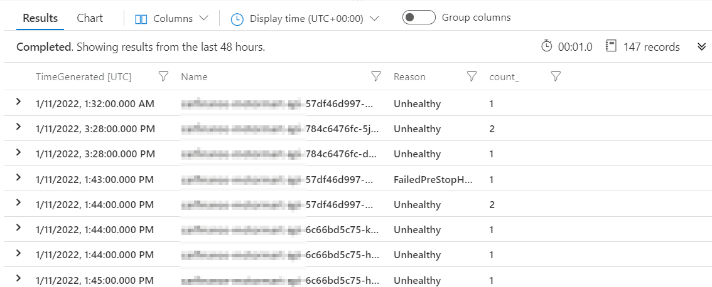

In this article, you'll learn how readiness, rollout strategy, endpoint draining, and Windows container lifecycle commands interact during a Kubernetes Deployment. That matters because a nominally “zero-downtime” rollout can still produce 502, 503, and 504 responses at the edge.

The original workload was an IIS application on .NET Framework 4.8 in a Windows container. A modest Artillery load test was enough to reveal gateway errors during Helm deployments.

## Begin with a timeline

Correlate client errors with Deployment conditions, Pod events, ingress or gateway backend health, and application shutdown logs. The useful question is not simply whether a new Pod became Ready; it is whether old endpoints stopped receiving traffic before their processes stopped accepting it.

A Kusto query can group Pod events around the rollout:

~~~kusto
KubeEvents
| where ObjectKind == "Pod"
| where ClusterName == "<cluster>" and Namespace == "<namespace>"
| order by TimeGenerated desc
| summarize count() by Name, Reason, bin(TimeGenerated, 1m)
~~~

## Fix the lifecycle hook

The failing event showed a preStop hook attempting to run sleep inside a Windows container. That executable was not present. Use a command the image actually provides:

~~~yaml
lifecycle:
  preStop:
    exec:
      command:
        - powershell.exe
        - -NoProfile
        - -Command
        - Start-Sleep -Seconds 30
terminationGracePeriodSeconds: 60
~~~

A delay only creates time for endpoint changes to propagate. The application should also stop advertising readiness, stop taking new work, complete or cancel bounded in-flight requests, and exit within the grace period.

## Give each probe one job

~~~yaml
startupProbe:
  httpGet:
    path: /health/startup
    port: 8080
  periodSeconds: 10
  failureThreshold: 30

readinessProbe:
  httpGet:
    path: /health/ready
    port: 8080
  periodSeconds: 5
  timeoutSeconds: 2
  failureThreshold: 3

livenessProbe:
  httpGet:
    path: /health/live
    port: 8080
  periodSeconds: 10
  timeoutSeconds: 2
  failureThreshold: 3
~~~

A startup probe gives slow startup time before liveness and readiness take effect. Readiness controls Service traffic. Liveness should detect a process that cannot recover, not fail merely because a downstream dependency is slow; otherwise Kubernetes can create a restart storm during an external outage.

## Review the whole rollout budget

Check replicas, maxUnavailable, maxSurge, resource requests, node headroom, topology spread, and gateway health-probe timing together. If one new Pod cannot be scheduled while an old Pod must remain, the rollout can stall. If maxUnavailable permits too much capacity loss, the rollout can overload the survivors.

A PodDisruptionBudget limits voluntary evictions through the Eviction API. It does not govern Deployment rolling updates, direct deletions, or crashes. Use the Deployment strategy for rollout capacity and a PDB for cluster-maintenance disruption.

Finally, run the same sustained request test while repeatedly rolling out and rolling back. Zero errors in one deployment is an observation; repeatable behavior under timing variation is evidence.

## References
- [Kubernetes Pod lifecycle](https://kubernetes.io/docs/concepts/workloads/pods/pod-lifecycle/)
- [Container lifecycle hooks](https://kubernetes.io/docs/concepts/containers/container-lifecycle-hooks/)
- [Deployment strategy](https://kubernetes.io/docs/concepts/workloads/controllers/deployment/#strategy)

## Closing thought

Availability during a rollout emerges when the Pod, Service, gateway, and application agree on the exact moment an instance becomes ready—and the exact moment it is no longer safe to call.
