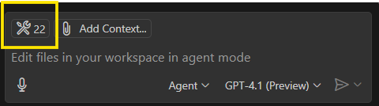
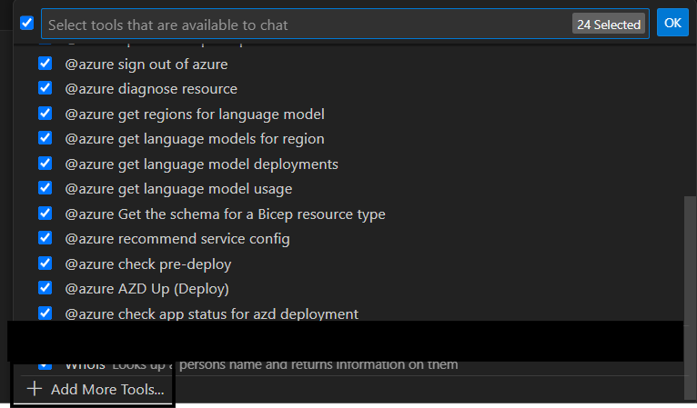
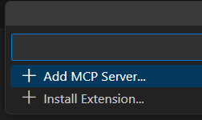
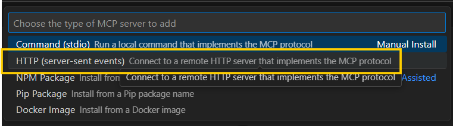
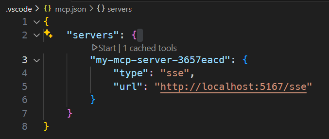
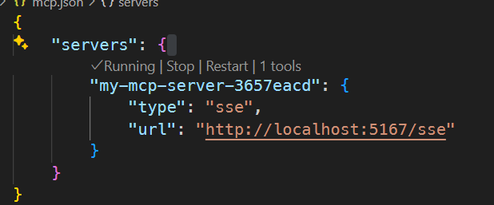
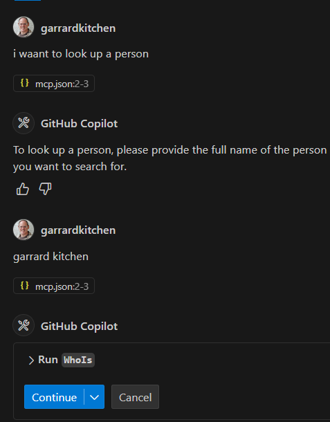
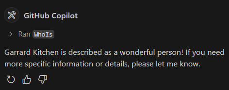

VSCode now allows you to add an MCP Server (remote) by entering it's URL.  This Short blog walks your through how to do this.

Get the MCP Server code from here:

Now move to the Agent pane and press the tools icons:

This will throw up this list. Select the '+ Add More Tools` option:

Then press `+ Add MCP Server...`:

As it's a HTTP Server which is push real-time events (see [Terminology](#terminology)), select the highlighted option:

Enter in your url and id, and the following server entry will be created in your `.vscode/mcp.json` file:

Next, press the press start button:

Now go to your Agent pane. I've asked to look up a person and its prompted me to enter a name, show I did:

After I clicked on the continue button, it responds with (I have to admit, I would agree 😜):

There you have it, now you're providing the Copilot, running in the VSCode host, a way to provide more context to your requests.

---

# Terminology

- **Server-Sent Events (SSE)**:

    In relation to MCP (Model Context Protocol) SSE a way for an MCP server to push real-time updates or context information to connected clients (such as editors or AI tools) over HTTP. With SSE, the server can continuously stream data—like file changes, user actions, or other context—without the client needing to repeatedly poll for updates. This enables efficient, low-latency communication and ensures that AI tools always have the latest context from the user's environment.

    **In summary**:

    SSE allows an MCP server to broadcast context changes to clients in real time, improving the responsiveness and accuracy of AI-powered features in tools that support MCP.