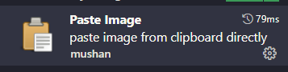

In this article, you'll learn what this site is for, how its technical notes will evolve, and what readers can expect from the archive. That matters because durable engineering comes from understanding trade-offs, not merely reproducing a command or pattern.

For the last 10+ years I've been a CTO for an exciting start-up. Recently that came to an abrupt and sad end. I will blog about the days and the efforts involved to keep the company afloat in the comming months and only when rawness of this fades.  Great team, great vision, great imagination.

Today is a new start for me, day 1 if you will.  With very little notice I have compiled this site to present the best side of me in order to become employed again.  I do have a strategy and oddly excited by this forced challenge.  I do not know what is around the corner for me.  Thankfully, I have a lot to offer.  I was exposed to everything a company has to do so this self-believe is not arrogance.  Only time will tell whether or not what I believe is a marketable set of skills.  If you have had the opportunity to working for a start-up then you will know the vast experience and contribution you give across the entire business.  I do hope my futures includes the challenge and excitment that this presents.

Paste Image Path:
${projectRoot}\content\posts\img

## Deepening the article

## A technical notebook with an editorial standard

This site is not intended to be a stream of untested snippets. A useful post should explain the problem, expose the assumptions behind the solution, and leave enough evidence for a reader to decide whether the advice still applies to their environment.

Older articles will therefore keep their original date while gaining technical review, clearer structure, and links to primary documentation. Commands that describe a historical toolchain will be labelled as such rather than silently presented as current best practice.

The archive will range across cloud platforms, software engineering, AI-assisted development, and games that reward technical curiosity. Those subjects look broad, but they share a question: how do people build a reliable mental model of a system they did not create alone?

## Closing thought

A technical archive becomes valuable not because it preserves every early conclusion, but because it makes the evolution of those conclusions visible and accountable.
