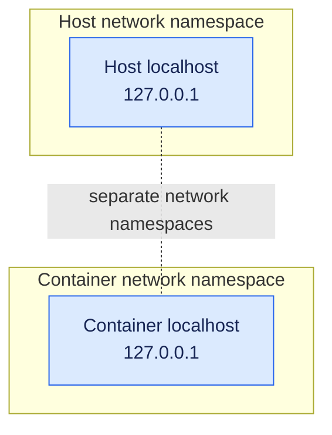
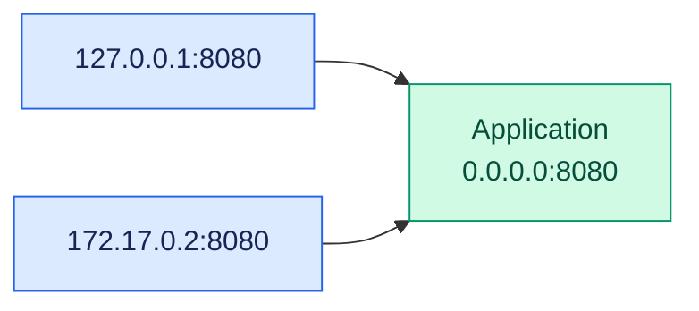
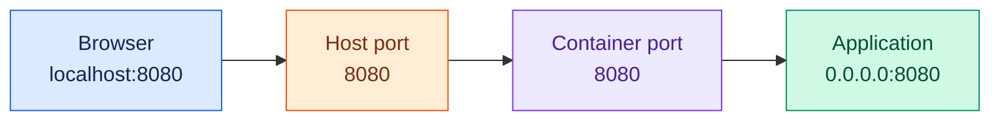

At first glance, container networking looks like a collection of small details: `localhost`, `0.0.0.0`, `eth0`, bridge networks, ports, and broadcast addresses. The details matter because each one answers a different question:

- Where is the application listening?
- Which network can reach it?
- Which port is being exposed?
- Is that exposure intentional?

This guide builds that picture from the inside out. You will learn why `localhost` inside a container is not the host, why container applications commonly bind to `0.0.0.0`, how Docker publishes ports, how Wi-Fi, Ethernet, and bridge interfaces fit into the path, and how to choose a safer default.

The goal is not merely to make a URL work. It is to understand exactly **who can reach the service and why**.

> [!TIP]
> The practical rule: make the application inside the container listen on `0.0.0.0`, then use Docker's port binding to decide who can reach it.

## The mental model

Containers have their own network namespace. That means the host and the container can both have a `localhost`, but they are not the same place.


## What `localhost` means

`localhost` normally resolves to `127.0.0.1`, the loopback address. It means “this network environment.”



If an application inside a container listens only on:

```text
127.0.0.1:8080
```

it is normally reachable only from inside that same container.

> [!WARNING]
> `localhost` inside a container does not normally mean the host. It means the container itself.

## What `0.0.0.0` does

`0.0.0.0` is a wildcard **bind address**. It tells a server:

> Listen on every local IPv4 address.

A container might have:

```text
127.0.0.1    loopback
172.17.0.2   container network address
```

If the application listens on `0.0.0.0:8080`, both local addresses can reach the application on port `8080`:



It does **not** mean every port, every machine, or internet access. `0.0.0.0:8080` covers port `8080`; it does not automatically cover `8081` or `8082`.

> [!NOTE]
> `0.0.0.0` is normally used when a server binds. It is not an address you normally type into a browser.

## Why containers commonly listen on `0.0.0.0`

Docker normally reaches a container through its virtual network interface, commonly called `eth0`:

```text
lo       127.0.0.1
eth0     172.17.0.2
```

Listening only on `127.0.0.1` can prevent Docker from reaching the application through `eth0`. Listening on `0.0.0.0` allows Docker to use the container network interface.

## Publishing a port with Docker

```bash
docker run -p 8080:8080 my-app
```

This maps the host port to the container port:



The full syntax is:

```text
-p host-ip:host-port:container-port
```

### Host-only access

```bash
docker run -p 127.0.0.1:8080:8080 my-app
```

Only the host can access the service through `http://localhost:8080`.

### One specific host interface

If the host's wired interface has IP address `192.168.1.30`:

```bash
docker run -p 192.168.1.30:8080:8080 my-app
```

Other reachable devices can use:

```text
http://192.168.1.30:8080
```

Use the IP address, not the interface name. This is incorrect:

```bash
docker run -p eth0:8080:8080 my-app
```

### All host IPv4 interfaces

```bash
docker run -p 0.0.0.0:8080:8080 my-app
```

This makes Docker listen on port `8080` through every host IPv4 interface, including Wi-Fi, Ethernet, and possibly bridge interfaces.

## Does this make the service internet-accessible?

Not automatically.

```mermaid
flowchart LR
    User["External client"] --> Network["Router / cloud network rules"]
    Network --> Firewall["Host firewall"]
    Firewall --> Published["Published host port"]
    Published --> Container["Container port"]
    Container --> Application["Application"]

    classDef external fill:#fee2e2,stroke:#dc2626,color:#7f1d1d
    classDef network fill:#ffedd5,stroke:#ea580c,color:#7c2d12
    classDef firewall fill:#fef3c7,stroke:#d97706,color:#78350f
    classDef docker fill:#ede9fe,stroke:#7c3aed,color:#4c1d95
    classDef app fill:#d1fae5,stroke:#059669,color:#064e3b
    class User external
    class Network network
    class Firewall firewall
    class Published,Container docker
    class Application app
```



External access also depends on firewall rules, cloud security groups, router/NAT forwarding, routing, and application authentication.

> [!CAUTION]
> Binding a host port to `0.0.0.0` removes the host-interface restriction. Do not expose an unauthenticated dashboard, database, or development API unintentionally.

## Docker, Podman, and host networking

The same concepts apply to both Docker and Podman, but the helper hostname can differ:

| Runtime | Container-to-host hostname |
|---|---|
| Docker Desktop | `host.docker.internal` |
| Docker Engine on Linux | Often `host.docker.internal` with `--add-host=host.docker.internal:host-gateway` |
| Podman | Prefer `host.containers.internal` |

Podman may also provide `host.docker.internal` for compatibility, but `host.containers.internal` is the Podman-native name. For example:

```bash
podman run --rm my-app curl http://host.containers.internal:8080
```

There is another option: share the host's network namespace.

```bash
podman run --rm --network=host my-app
```

With host networking, `localhost` inside the container refers to the host's network namespace. A service running on the host at `127.0.0.1:8080` can therefore be reached from the container as:

```text
http://127.0.0.1:8080
```

Host networking also means the container's application binds directly to host ports, so port collisions are possible and Docker-style `-p` publishing is unnecessary. More importantly, it removes network isolation: Podman warns that host mode can give the container access to local system services and considers it insecure; Docker similarly documents that the container shares the host network stack and has no separate container IP. See the [Podman network-mode documentation](https://docs.podman.io/en/latest/markdown/podman-run.1.html) and [Docker host network documentation](https://docs.docker.com/engine/network/drivers/host/).

> [!WARNING]
> Use `--network=host` for a specific, understood requirement—such as low-level network tooling or a service needing a large range of ports—not as the default way to reach the host. A host-gateway hostname preserves more of the container's network boundary.

## `0.0.0.0` is not broadcast

Broadcast is a separate IPv4 concept: sending traffic to every device on a local network.

Common broadcast addresses include:

```text
255.255.255.255
192.168.1.255    # broadcast for 192.168.1.0/24
```

| Address | Meaning |
|---|---|
| `127.0.0.1` | This network environment only |
| `0.0.0.0` | Wildcard bind address |
| `255.255.255.255` | Limited IPv4 broadcast |
| `192.168.1.255` | Example subnet broadcast |

> [!TIP]
> For a web service, say “publish,” “expose,” or “make reachable.” “Broadcast” usually describes discovery traffic such as DHCP or ARP, not normal HTTP access.

## A sensible security pattern

For local development:

```bash
docker run -p 127.0.0.1:8080:8080 my-app
```

Inside the container, configure the application to listen on:

```text
0.0.0.0:8080
```

This lets Docker reach the application while keeping it accessible only from the host.

If LAN access is required, bind to the host's LAN IP. Use `0.0.0.0` at the host level only when all host interfaces genuinely need to accept connections.

Apply authentication, HTTPS, firewall rules, least-privilege network access, regular updates, and vulnerability scanning.

This pattern follows two established security principles:

- [OWASP Docker Security Cheat Sheet](https://cheatsheetseries.owasp.org/cheatsheets/Docker_Security_Cheat_Sheet.html) warns that publishing a port without an explicit host IP can open it on all interfaces, and recommends binding the host side to `127.0.0.1` when local-only access is intended.
- [NIST SP 800-190, Application Container Security Guide](https://doi.org/10.6028/NIST.SP.800-190) recommends controlling container network traffic and avoiding unbounded access between networks with different sensitivities.

The lesson is simple: **reachability is part of the security boundary**. A port is not “just a port” once it is published; it becomes a possible path to the application.

## The rule worth remembering

> [!TIP]
> Inside the container, listen on `0.0.0.0` so Docker can reach the application. On the host, publish the port only on the interfaces that genuinely need access.

```text
Client
  ↓
Host IP and port
  ↓
Docker published port
  ↓
Container port
  ↓
Application listening on 0.0.0.0
```

For example:

```text
http://192.168.1.30:8080
        ↓
host 192.168.1.30:8080
        ↓
container 172.17.0.2:8080
        ↓
application 0.0.0.0:8080
```

## Closing thought

> A container is not secure because it is difficult to see. It is secure when its boundaries are deliberate: the application listens where it must, the host publishes only what is needed, and every reachable path has an owner.

Once you understand that distinction, `localhost` and `0.0.0.0` stop being mysterious values. They become precise statements about **where a service listens, how far it can travel, and how much trust you are willing to grant**.
